以上方式selenium也有, 比较通用, sahi独有的方式是:

1. 主动查找页面可见的熟悉, 比如title, value, 允许开发之对每一种元素设置不同属性和特定的查找顺序，包括那些自定义的属性名, eg:

   _link(“valueName”)用来定位一个定义为“valueName”的 link，这里的 valueName 并不一定是 value 的属性值，也可以是它的 id、title 等

2. Sahi 主要提供了三种基于上下文的元素 API：_in，_near 和_under. 

   1. _in 是指在某个 DOM 节点下查找某个元素，这比 Xpath 的不管是绝对路径或是相对路径查找都来的灵活，不会因为 DOM 树内部结构发生变化而导致路径失效找不到元素的问题。

   2. _near 是指在某个元素附近查找相应设定规则条件的最近一个元素，这对于一个页面中有多个相同属性值的情况提供了一个很好的解决方式，使查找的范围更精确。_

   3. under 是指在某个元素下方开始查找，找到符合条件的最近一个元素，一般_under 都适用在具有相同偏移量的同一列中。

      举例: 下面，我们来看一个例子，加深对 Sahi 这种基于上下文识别查找机制的理解：

      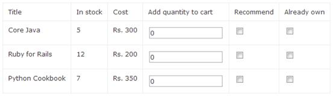

      假设，在图 2 显示的 Web 页面的所有 text box 的 name=”q”; Sahi 可以通过_near 这种方式来定位：

      ```
      `_textbox("q",_near(_cell("Ruby for Rails")))`
      ```

   当要定位 check box 时，我们又会发现，“Ruby for Rails”这一行有“Recommend”和“Already own”两个 check box，为了更准确地定位，我们可以结合_under，例如：_checkbox(0,_near(_cell("Ruby for Rails")),_under(_cell("Recommend")))。

   Sahi API 中的 identifier 参数都支持正则表达式，例如，_div(/name.*/) 用来识别所有以某种预属性值是 name 开头的 div。

#### 隐式页面加载响应等待机制：

Selenium 等自动化测试工具通常会在脚本中人为来设定一个固定的等待时间。但这往往被证实不一定是准确的。

Sahi 内置了智能的页面等待机制，能够自动判断 Ajax 请求是否已经处理完毕，然后继续下一步操作。并且，这一点对于用户是“隐式”的，不需要增加额外的代码。

## 工作原理：

使用自带的录制工具, 录制操作过程, 生成sahi代码, 精炼并开发, 就可以回放测试了

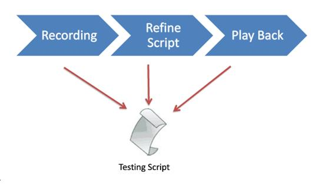

### 第一步：录制


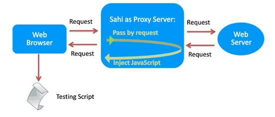

### 第二步：精炼脚本

Refine Script 过程的工作原理:

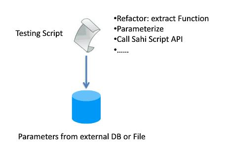

录制的脚本都是指定元素并唯一操作的，这时就需要对代码进行重构，抽取出核心的功能块，对其中的元素进行参数化处理，以实现重用。这样的数据可以从外部的 DB 或文件中读取而来。与此同时，也可调用 Sahi API 或外部 Java 等 API 实现特定的一些功能。

### 第三步：回放

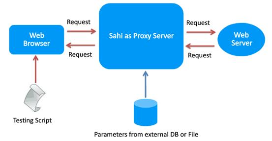

Sahi 运行提炼好的脚本来自动化测试操作，并生成测试报告。

## 安装部署与配置

下载: 开源, 在SourceForge 上，可以通过点击[这里](http://sourceforge.net/projects/sahi/?source=directory)下载。

默认推荐是下载 **install_sahi_xxx.jar**，这是一个可执行文件，包含了 Sahi 的安装器和 Sahi 工具及其源代码。当然您也可以点击上图红框处**“Browse All Files”**来选择历史版本和一些免安装压缩文件。比如，选择只包含 Sahi 工具的**sahi_xxx.zip** 文件，或者包含了 Sahi 和源代码的免安装压缩包文 件**sahi-src_xxx.zip**。

**建议选择推荐的 Sahi 安装包文件即可，这样可以免去一些设置操作，并可以选择是否安装源代码。双击 jar 文件进行安装**

安装过程非常简单，待安装完成后双击桌面图标打开 Sahi 程序。打开程序先会出现一个 Sahi Dashboard，它能自动开启 Sahi 代理服务来启动浏览器，而不需要繁琐的代理服务器设置操作。当然如有需要，您也可以手动修改这些代理设置。

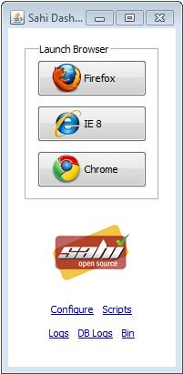

Sahi 会自动去侦探您系统里安装的一些浏览器，并在 Sahi Dashboard 上显示出来，如果发现有一些其他的浏览器未被准确侦探出来，您也可以点击下面的“Configure”来进行配置添加进来。

接下来，通过点击 Sahi Dashboard 上的浏览器图标按钮来启动相应浏览器.

您可以输入起始测试的网页 URL 开始您的测试。如果测试的目标 URL 是 HTTPS 协议的，也可以点击“SSL Manager”来查看和管理 SSL 证书。

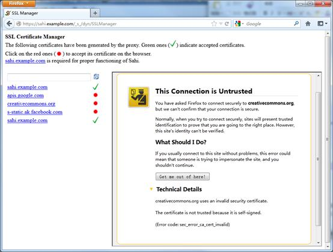

按住 Alt 键并双击页面，将弹出 Sahi 控制窗口，如图:

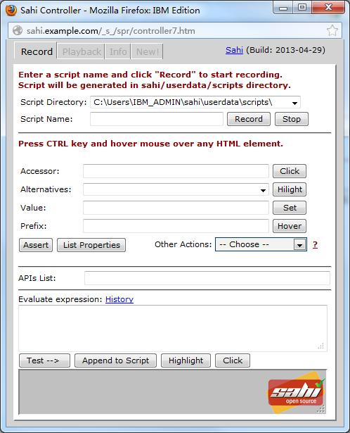

这个窗口相当于 Sahi 的主控台，在这里我们可以来录制和回放 Sahi 脚本，并编辑和管理脚本信息。

在 Record 视图界面，输入一个脚本名称，点击“Record”，这时 Sahi 录制器便开始工作了。把鼠标移到浏览器上的目标网页上，您的所有操作过程都将被记录下来。您也可以自定义增加一个 Assertion。按住 Ctrl 键，把鼠标移动到目标网页的任意一个 HTML 元素，那么这个 Accessor 会自动出现在 Sahi 控制器中。这时，便可以自定制对该元素的操作。常用的操作有“点击”，“高亮”，“赋值等。同时，您可以通过“Append to Script”按钮来加到脚本代码中。录制完成后按“Stop”来结束整个过程。

以下为:Sahi 自动录制过程得到的 Sahi 脚本代码。其大致过程为：通过百度搜索“sahi”关键字，校验 Sahi 官网的 assert 是否存在，点击进入 Sahi 官网后继续校验 assert“Community Forums”，点击进入。通过前一节“Sahi Controller 录制”来完成这个操作过程，那么，您可以在默认目录“C:\Users\IBM_ADMIN\sahi\userdata\scripts”中找到先前命名为“Test_sahi”的脚本文件，我们可以将这段代码进行一个精炼和丰富的过程，比如在点击“Community Forums”链接前将它进行高亮操作：

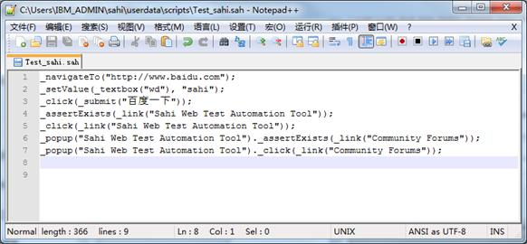

```sahi
_popup("Sahi Web Test Automation Tool")
_highlight(_link("Community Forums"));
```

或者您想在 Sahi 脚本代码中调用内置的 Java 类，例如：

```java
function printThroughJava(s)
{
	java.lang.System.out.println("Through Java: "+s);
}
printThroughJava("Hi there");
	
```

“Through Java: Hi there”将在 sahi 的命令行中输出。

回放的时候，只需要在 Sahi 控制台上切换到“Playback”tab 页面，找到脚本存放的路径，下面就有开始、暂停和结束等按钮来进行操作。需要注意的是，开始以前必须给它设置一个“Start URL”否则无法回放脚本。脚本回放的时候，在“Statements”里可以看到脚本运行的日志，比如操作步骤和一些错误信息等。

通过点击右下角的“View Logs”可以查看详细的 Sahi 运行日志报告：

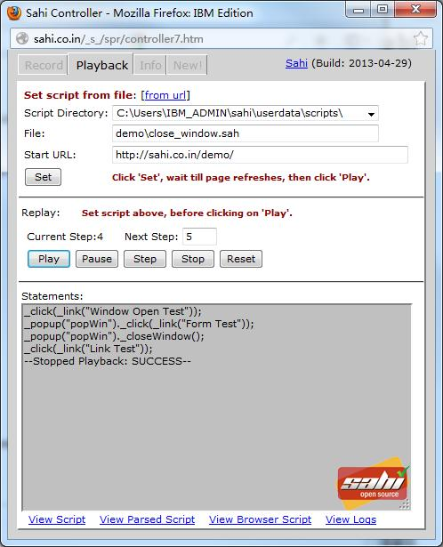

Sahi 日志报告:

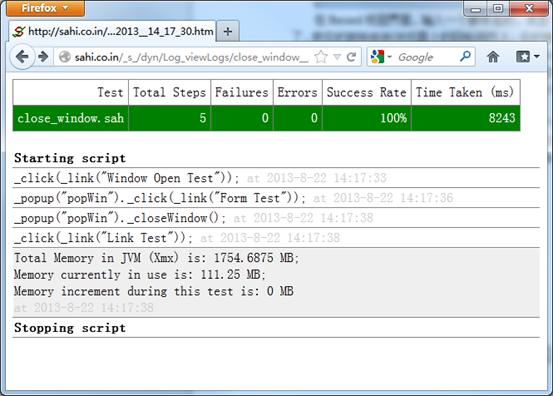

由图可见，这样自动录制生成的脚本代码都是 Sahi 代码，我们可以在实际的 Java 项目中调用这些 Sahi 代码，以实现重用。其实，我们可以通过打开 sahi/config/sahi.properties 文件将其中属性设置为 controller.mode=java 来实现自动录制脚本的语言为 Java。值得注意的是，改为 Java 语言录制后的 Sahi 控制器和原来有所不同，它的界面更简洁，功能也更简单一些，没有了自动回放功能。因为，这更多是为了自动生成一些简单的脚本，来提高开发人员的开发效率. 

## 语法与示例应用

Sahi 脚本是基于 JavaScript 的，而 Sahi 脚本是通过代理解析的，并能够在 rhino JavaScript 引擎中有效执行的。除了变量前的强制符$，它和 JavaScript 基本很像。

Sahi 操作的代码**声明**是一句以分号结尾的普通代码行，如：

```
_click(_link("Login"));
```

**变量声明**：

```
var$variableName =value;
```

或者先声明再赋值：

```js
 var $variableName;// declaration
 $variableName =value;// assignment
```

所有的变量都是以$符号开头的，关键字 var 用于局部变量，如：

```js
var $username ="SahiTestUser";
var $password;
// declaration;
$password =$username +"_password";
// "SahiTestUser_password"
```

**函数声明**：

```
// function 
declarationfunctionlogin($usr,$pwd){
	_click(_link("Login"));
  _setValue(_textbox("username"),$usr);
  _setValue(_password("password"),$pwd);
  _click(_submit("Login"));
}
// function call
login("sahi_user","secret");`
```

在一个 Sahi 代码文件中可以通过**_include**来包含调用其他 Sahi 文件，如：

```js
_include("includes/common_functions.sah");
```

由上面的语法可知，Sahi 是由下划线开头，带上操作或 HTML 元素，非常简单，清晰易懂，这些 API 基本都是能够看字面就能理解它的功能。

Sahi 的 API 主要可以分为 3 类：**浏览器访问 API**、**浏览器操作 API**和**混合 API**。

**浏览器访问 API**：用于访问浏览器上的元素，并通过代理来注入这些 API 到浏览器中去。

**浏览器操作 API**：主要来执行一些如点击、输入数据等操作，并在浏览器上声明这些元素的。

**混合 API**：是既能在浏览器又能在代理上用于处理异常和操作文件和数据库的。

由于 Sahi 对网页的访问方法的 API 很多，大家可以参考[官方 API 文档](http://sahi.co.in/w/all-apis)进行学习。

由上可知，Sahi 脚本都是很直接的声明和操作过程，在一个运行的代理上，由 Sahi Dashboard 来管理执行。如果我们希望能够将我们的 Sahi 自动执行的过程与我们其他的项目功能模块进行集成，那么把这些脚本转换成 Java 代码，又能用独立运行，是一件两全其美的事。

接下来，本文将介绍一个用 Sahi Java Driver 来编写 Sahi 自动化脚本实现 Web 自动化测试的简单案例。

首先，将 Sahi 的开发库包文件 sahi.jar 加入到 Java 项目中，该文件位于 Sahi 安装路径下..\sahi\lib\下，接下来就可以参考 Sahi 的 [Java API](http://sahi.co.in/java/javadocs/) 来开发自动化测试脚本。下面是一个简单的案例脚本：

##### 清单 1. 导入 Sahi 类包

```
`import net.sf.sahi.client.Browser;``import net.sf.sahi.config.Configuration;`
```

设置 sahi 安装路径和 userdata 路径

##### 清单 2. 配置 Sahi 代理

```
`String sahiBase = "C:/Users/ADMIN/sahi/"; ``String userDataDirectory = "C:/Users/ADMIN/sahi/userdata"; ``Configuration.initJava(sahiBase, userDataDirectory);`
```

您可以设置任意一种浏览器类型，也可以在 sahi/userdata/config/browser_types.xml 文件中自己创建定义

##### 清单 3. 配置浏览器并启动

```
`String browserType = "firefox";``Browser browser = new Browser(browserType);``browser.open();`
```

##### 清单 4. 操作代码示例

```
`browser.navigateTo("http://sahi.co.in/demo/training/");``browser.textbox("user").setValue("test");``browser.password("password").setValue("secret");``browser.submit("Login").click();``browser.textbox("q").setValue("2");``browser.textbox("q[1]").setValue("9");``browser.textbox("q[2]").setValue("4");``browser.button("Add").click();``System.out.println(":: browser.textbox(\"total\").value()=" + browser.<``br``>textbox("total").value());``browser.close();// close the browser`
```

需要注意一点，除了 Firefox 浏览器，其他的浏览器都必须进行服务器代理配置，并在运行脚本前打开 Sahi 代理服务。

实际测试结果表明，Sahi 代码简介，运行轻巧快速，而且它还能与外置的一些模块集成完成发送邮件，读取 PDF 文件等操作，功能非常完善。

## Question

1. Web2.0技术指的是? 现在版本几了?
2. 此文不知几时发布的, Selenium现在还是只有Firefox的录制器吗?

## Referrence

https://www.ibm.com/developerworks/cn/web/1403_yangxb_sahi/index.html

