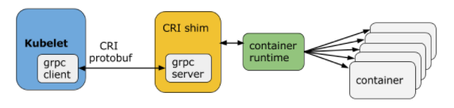

# 158
## 原有服务到microservice架构
* 重构方式：
  1. 停止新功能的实现，彻底重构
  2. 新功能用微服务方式实现，逐步重构；
* 挑战：
  * 重构方式
    * 用原语言实现（重用部分旧代码）更加经济；
    * 设计不好的应该以新技术架构思路重新设计实现
    * 与数据过分耦合的应用可能无法重构；
  * 重构完成后选择机制/工具，保持所有模块的弹性；
## container Orchestration
1. Define the concept of container orchestration.
  container
  Microservices
  Container Orchestration
    已知的orchestrator ，推荐学习edx151x课程https://www.edx.org/course/introduction-cloud-infrastructure-linuxfoundationx-lfs151-x，

2. Explain the reasons for doing container orchestration.
3. Discuss different container orchestration options.
4. Discuss different container orchestration deployment options.

## Chapter 4. Kubernetes Architecture

### 4.2 the Kubernetes architecture.
  * high Level arch
    * One or more master nodes
    * One or more worker nodes
    * Distributed key-value store, such as etcd.

  * detail level architecture
    * Master node
      manage state of a Kubernetes cluster;has the following components:
      * API server
        * kube-apiserver
      * Scheduler
      * Controller managers
      * etcd.
#### 4.2.3 Worker Node
<!--- A worker node provides a running environment for client applications. Though containerized microservices, these applications are encapsulated in Pods, controlled by the cluster control plane agents running on the master node. Pods are scheduled on worker nodes, where they find required compute, memory and storage resources to run, and networking to talk to each other and the outside world. A Pod is the smallest scheduling unit in Kubernetes. It is a logical collection of one or more containers scheduled together. We will explore them further in later chapters.
--->
worker节点为客户端应用程序提供运行环境。通过容器化的微服务，这些应用程序被封装在Pods中，由运行在主节点上的集群控制平面代理控制。pod被安排在worker节点上，在那里它们可以找到运行所需的计算、内存和存储资源，并可以通过网络与彼此和外部世界进行通信。Pod是Kubernetes中最小的调度单元。它是一个或多个编排在一起的容器的逻辑集合。我们将在后面的章节中进一步探讨它们。

Kubernetes Worker Node

[^_^]: # Also, to access the applications from the external world, we connect to worker nodes and not to the master node. We will dive deeper into this in future chapters.
同时，从外部世界访问应用程序时，我们连接到工作节点而不是主节点。我们将在以后的章节中深入探讨这个问题。
##### Worker Node Components
<!---
    A worker node has the following components:
    * Container runtime
    * kubelet
    * kube-proxy
    * Addons for DNS, Dashboard, cluster-level monitoring and logging.

    In the next few sections, we will discuss them in more detail.
--->
工作节点具有以下组件：
* 容器运行时
* kubelet
* kube-proxy
* 用于DNS、Dashboard、集群级监控和日志记录的加载项。

在接下来的几节中，我们将更详细地讨论它们。
##### Container Runtime
<!---
    Although Kubernetes is described as a "container orchestration engine", it does not have the capability to directly handle containers. In order to run and manage a container's lifecycle, Kubernetes requires a container runtime on the node where a Pod and its containers are to be scheduled. Kubernetes supports many container runtimes:

    Docker - although a container platform which uses containerd as a container runtime, it is the most widely used container runtime with Kubernetes
    CRI-O - a lightweight container runtime for Kubernetes, it also supports Docker image registries
    containerd - a simple and portable container runtime providing robustness
    rkt - a pod-native container engine, it also runs Docker images
    rktlet - a Kubernetes Container Runtime Interface (CRI) implementation using rkt.
--->
尽管Kubernetes被描述为一个“容器编排引擎”，但它没有直接处理容器的能力。为了运行和管理容器的生命周期，Kubernetes需要在Pod及其容器的调度节点上有一个容器运行时。Kubernetes支持许多容器运行时：
* Docker - 虽然是一个使用containerd作为容器运行时的容器平台，但它是Kubernetes最广泛使用的容器运行时
* CRI-O-一个用于Kubernetes的轻量级容器运行时，它还支持Docker映像注册
* containerd — 提供健壮性的简单可移植的容器运行时
* rkt - 一个pod本地容器引擎，它还运行Docker映像
* rktlet - 一个使用rkt的Kubernetes容器运行时接口（CRI）实现。
##### kubelet
<!---
 The kubelet is an agent running on each node and communicates with the control plane components from the master node. It receives Pod definitions, primarily from the API server, and interacts with the container runtime on the node to run containers associated with the Pod. It also monitors the health of the Pod's running containers.

 The kubelet connects to the container runtime using Container Runtime Interface (CRI). CRI consists of protocol buffers, gRPC API, and libraries.
--->
kubelet是运行在每个节点上的代理，并与主节点的控制平面组件通信。它主要从API server接收Pod定义，并与节点上的容器运行时交互以运行与Pod相关的容器。它还监测吊舱运行容器的健康状况。
kubelet使用容器运行时接口（container runtime Interface，CRI）连接到容器运行时。CRI由协议缓冲区、gRPC API和库组成

Container Runtime Interface
(Retrieved from blog.kubernetes.io)
<!---
 As shown above, the kubelet acting as grpc client connects to the CRI shim acting as grpc server to perform container and image operations. CRI implements two services: ImageService and RuntimeService. The ImageService is responsible for all the image-related operations, while the RuntimeService is responsible for all the Pod and container-related operations.
 Container runtimes used to be hard-coded in Kubernetes, but with the development of CRI, Kubernetes is more flexible now and uses different container runtimes without the need to recompile. Any container runtime that implements CRI can be used by Kubernetes to manage Pods, containers, and container images.
 In the next section, we will discuss some of the CRI shims.
--->
如上所示，充当grpc客户端的kubelet连接到充当grpc服务器的CRI shim，以执行容器和image操作。CRI实现了两个服务：ImageService和RuntimeService。ImageService负责所有与image相关的操作，RuntimeService负责所有与Pod和容器相关的操作。
容器运行时在Kubernetes中是写死的，但是随着CRI的发展，Kubernetes现在更加灵活，并且使用不同的容器运行时而不需要重新编译。Kubernetes可以使用任何实现CRI的容器运行时来管理pod、容器和容器映像。
在下一节中，我们将讨论一些CRI Shim。
#####  kubelet - CRI shims
Below you will find some examples of CRI shims:

* dockershim
<!---
With dockershim, containers are created using Docker installed on the worker nodes. Internally, Docker uses containerd to create and manage containers.
--->

dockershim
(Retrieved from blog.kubernetes.io)
使用dockershim，容器是使用安装在工作节点上的Docker创建的。在内部，Docker使用containerd创建和管理容器。
* cri-containerd
<!--- With cri-containerd, we can directly use Docker's smaller offspring containerd to create and manage containers.
--->
使用cri-containerd，我们可以直接使用Docker更小的子程序containerd来创建和管理容器。

* CRI-O
<!---
CRI-O enables using any Open Container Initiative (OCI) compatible runtimes with Kubernetes. At the time this course was created, CRI-O supported runC and Clear Containers as container runtimes. However, in principle, any OCI-compliant runtime can be plugged-in.

CRI-O
 CRI-O enables using any Open Container Initiative (OCI) compatible runtimes with Kubernetes. At the time this course was created, CRI-O supported runC and Clear Containers as container runtimes. However, in principle, any OCI-compliant runtime can be plugged-in.
--->

CRI-O支持使用任何与Kubernetes兼容的开放容器倡议（OCI）的运行时。在创建本课程时，CRI-O支持runC和Clear Containers作为容器运行时。但是，原则上，任何符合OCI的运行时都可以插入。


##### kube-proxy
<!---
[^_^]: # The kube-proxy is the network agent which runs on each node responsible for dynamic updates and maintenance of all networking rules on the node. It abstracts the details of Pods networking and forwards connection requests to Pods.
[^_^]: # We will explore Pod networking in more detail in later chapters.
--->
kube代理是运行在每个节点上的网络代理，负责动态更新和维护节点上的所有网络规则。它抽象了Pods网络的细节，并将连接请求转发给Pods。
我们将在后面的章节中更详细地探讨Pod网络。
##### Addons
<!---
    Addons are cluster features and functionality not yet available in Kubernetes, therefore implemented through 3rd-party pods and services.

    DNS - cluster DNS is a DNS server required to assign DNS records to Kubernetes objects and resources
    Dashboard - a general purposed web-based user interface for cluster management
    Monitoring - collects cluster-level container metrics and saves them to a central data store
    Logging - collects cluster-level container logs and saves them to a central log store for analysis.
--->
Addon是Kubernetes中尚未提供的集群特性和功能，因此通过第三方pod和服务实现。
* DNS-集群DNS是将DNS记录分配给Kubernetes对象和资源所需的DNS服务器
* Dashboard-一个通用的基于web的集群管理用户界面
* 监视-收集集群级容器度量并将其保存到中心数据存储
* 日志记录-收集群集级容器日志，并将其保存到中心日志存储以进行分析。
#### Networking Challenges
<!---
    Decoupled microservices based applications rely heavily on networking in order to mimic the tight-coupling once available in the monolithic era. Networking, in general, is not the easiest to understand and implement. Kubernetes is no exception - as a containerized microservices orchestrator is needs to address 4 distinct networking challenges:

    Container-to-container communication inside Pods
    Pod-to-Pod communication on the same node and across cluster nodes
    Pod-to-Service communication within the same namespace and across cluster namespaces
    External-to-Service communication for clients to access applications in a cluster.
    All these networking challenges must be addressed before deploying a Kubernetes cluster. Next, we will see how we solve these challenges.
--->
基于解耦的微服务的应用程序在很大程度上依赖于网络，以模拟在单一程序时代曾经存在的紧密耦合。一般来说，网络并不是最容易理解和实现的。Kubernetes也不例外-作为一个容器化的微服务编排器，需要解决4个不同的网络挑战：
* Pods内容器对容器的通信
* 同一节点上或集群节点之间的Pod-to-Pod通信
* Pod到服务 在同一命名空间内和跨集群命名空间的通信
* 外部到服务的通信，以便客户端访问集群中的应用程序。
在部署Kubernetes集群之前，必须解决所有这些网络挑战。接下来，我们将看看如何解决这些挑战。

##### Container-to-Container Communication Inside Pods
<!---
[^_^]: # Making use of the underlying host operating system's kernel features, a container runtime creates an isolated network space for each container it starts. On Linux, that isolated network space is referred to as a network namespace. A network namespace is shared across containers, or with the host operating system.

[^_^]: # When a Pod is started, a network namespace is created inside the Pod, and all containers running inside the Pod will share that network namespace so that they can talk to each other via localhost.
利用底层主机操作系统的内核特性，容器运行时为它启动的每个容器创建一个独立的网络空间。在Linux上，隔离的网络空间称为网络命名空间。网络命名空间是跨容器或与主机操作系统共享的。
--->
当Pod启动时，在Pod内创建一个网络名称空间，运行在Pod内的所有容器都将共享该网络名称空间，以便它们可以通过localhost相互通信。
##### Pod-to-Pod Communication Across Nodes
<!---
In a Kubernetes cluster Pods are scheduled on nodes randomly. Regardless of their host node, Pods are expected to be able to communicate with all other Pods in the cluster, all this without the implementation of Network Address Translation (NAT). This is a fundamental requirement of any networking implementation in Kubernetes.

The Kubernetes network model aims to reduce complexity, and it treats Pods as VMs on a network, where each VM receives an IP address - thus each Pod receiving an IP address. This model is called "IP-per-Pod" and ensures Pod-to-Pod communication, just as VMs are able to communicate with each other.

You can try
 Let's not forget about containers though. They share the Pod's network namespace and must coordinate ports assignment inside the Pod just as applications would on a VM, all while being able to communicate with each other on localhost - inside the Pod. However, containers are integrated with the overall Kubernetes networking model through the use of the Container Network Interface (CNI) supported by CNI plugins. CNI is a set of a specification and libraries which allow plugins to configure the networking for containers. While there are a few core plugins, most CNI plugins are 3rd-party Software Defined Networking (SDN) solutions implementing the Kubernetes networking model. In addition to addressing the fundamental requirement of the networking model, some networking solutions offer support for Network Policies. Flannel, Weave, Calico are only a few of the SDN solutions available for Kubernetes clusters.

--->
在Kubernetes集群中，pod被随机地安排在节点上。不管它们的主机节点是什么，pod都可以与集群中的所有其他pod通信，而无需实现网络地址转换（Network Address Translation，NAT）。这是Kubernetes中任何网络实现的基本要求。
KubNetes网络模型旨在降低复杂性，并将POD视为网络上的VMS，其中每个VM接收IP地址-因此每个POD接收IP地址。这个模型被称为“IP-per-Pod”，确保了Pod到Pod的通信，就像vm能够相互通信一样。
不过，别忘了容器。它们共享Pod的网络名称空间，必须像VM上的应用程序那样协调Pod内的端口分配，同时能够在本地主机（Pod内）上相互通信。然而，通过使用CNI插件支持的容器网络接口（CNI），容器与整个Kubernetes网络模型集成。CNI是一组规范和库，允许插件为容器配置网络。虽然有一些核心插件，但大多数CNI插件是实现Kubernetes网络模型的第三方软件定义网络（SDN）解决方案。除了满足网络模型的基本要求外，一些网络解决方案还为网络策略提供支持。Flannel, Weave, Calico 只是Kubernetes集群可用的SDN解决方案的其中几个。

<!---
  The container runtime offloads the IP assignment to CNI, which connects to the underlying configured plugin, such as Bridge or MACvlan, to get the IP address. Once the IP address is given by the respective plugin, CNI forwards it back to the requested container runtime.
  For more details, you can explore the Kubernetes documentation.
--->
容器运行时将IP分配的任务发到CNI，CNI连接到底层配置的插件（如Bridge或MACvlan）以获取IP地址。一旦IP地址由相应的插件给出，CNI就会将其转发回请求的容器运行时。

有关更多详细信息，可以浏览Kubernetes文档。
##### Pod-to-External World Communication
<!---
For a successfully deployed containerized applications running in Pods inside a Kubernetes cluster, it requires accessibility from the outside world. Kubernetes enables external accessibility through services, complex constructs which encapsulate networking rules definitions on cluster nodes. By exposing services to the external world with kube-proxy, applications become accessible from outside the cluster over a virtual IP.

We will have a complete chapter dedicated to this, so we will dive into this later.
--->
对于在Kubernetes集群内的Pods中运行的成功部署的容器化应用程序，它需要来自外部世界的可访问性。Kubernetes通过服务实现外部可访问性，这些服务是封装集群节点上的网络规则定义的复杂构造。通过使用kube代理将服务公开给外部世界，应用程序可以通过虚拟IP从集群外部访问。
我们将有一个完整的章节专门讨论这个问题，所以我们稍后将深入讨论这个问题。
## Chapter 5. Installing Kubernetes
### Introduction and Learning Objectives
<!--
In this chapter, we will first discuss about the different configurations in which Kubernetes can be installed. We will then discuss about the infrastructure requirements to install Kubernetes, and we will also look at some of the tools which can help us with the installation.
By the end of this chapter, you should be able to:
* Discuss about the different Kubernetes configuration options.
* Discuss infrastructure considerations before installing Kubernetes.
* Discuss infrastructure choices for a Kubernetes deployment.
* Review Kubernetes installation tools and resources.
--->
在本章中，我们将首先讨论可以安装Kubernetes的不同配置。然后，我们将讨论安装Kubernetes所需的基础设施，我们还将介绍一些可以帮助我们进行安装的工具。
在本章结束时，您应该能够：
* 讨论不同的Kubernetes配置选项。
* 在安装Kubernetes之前讨论基础设施考虑事项。
* 讨论Kubernetes部署的基础设施选择。
* 回顾Kubernetes安装工具和资源。

### Installing Kubernetes
#### Kubernetes Configuration
<!---
Kubernetes can be installed using different configurations. The four major installation types are briefly presented below:
* All-in-One Single-Node Installation
In this setup, all the master and worker components are installed and running on a single-node. While it is useful for learning, development, and testing, and it should not be used in production. Minikube is one such example, and we are going to explore it in future chapters.
* Single-Node etcd, Single-Master and Multi-Worker Installation
In this setup, we have a single-master node, which also runs a single-node etcd instance. Multiple worker nodes are connected to the master node.
* Single-Node etcd, Multi-Master and Multi-Worker Installation
In this setup, we have multiple-master nodes configured in HA mode, but we have a single-node etcd instance. Multiple worker nodes are connected to the master nodes.
* Multi-Node etcd, Multi-Master and Multi-Worker Installation
In this mode, etcd is configured in clustered HA mode, the master nodes are all configured in HA mode, connecting to multiple worker nodes. This is the most advanced and recommended production setup.
--->

可以使用不同的配置安装Kubernetes。以下简要介绍四种主要安装类型：
* 一体式单节点安装
在此设置中，所有主组件和工作组件都安装在一个节点上并运行。虽然它对学习、开发和测试很有用，但不应在生产中使用。Minikube就是这样一个例子，我们将在以后的章节中对此进行探讨。
* 单节点etcd，单主多工安装
在这个设置中，我们有一个主节点，它也运行一个节点etcd实例。多个工作节点连接到主节点。
* 单节点etcd，多主多工安装
在这个设置中，我们在HA模式下配置了多个主节点，但是我们有一个单节点etcd实例。多个工作节点连接到主节点。
* 多节点etcd、多主多工安装
在此模式下，etcd配置为集群HA模式，主节点都配置为HA模式，连接到多个工作节点。这是最先进和推荐的生产设置。

#### Infrastructure for Kubernetes Installation
<!---
Once we decide on the installation type, we also need to make some infrastructure-related decisions, such as:
* Should we set up Kubernetes on bare metal, public cloud, or private cloud?
* Which underlying OS should we use? Should we choose RHEL, CoreOS, CentOS, or something else?
* Which networking solution should we use?
And so on.
Explore the Kubernetes documentation for details on choosing the right solution. Next, we will take a closer look at these solutions.
--->
一旦我们决定了安装类型，我们还需要做出一些与基础设施相关的决定，例如：
* 我们应该在裸机、公共云或私有云上设置Kubernetes吗？
* 我们应该使用哪些底层操作系统？我们应该选择莱尔、科罗斯、森托斯还是别的什么？
* 我们应该使用哪种网络解决方案？
等等。
有关选择正确解决方案的详细信息，请参阅Kubernetes文档。接下来，我们将仔细研究这些解决方案。
#### Localhost Installation
<!---
These are only a few localhost installation options available to deploy single- or multi-node Kubernetes clusters on our workstation/laptop:
* Minikube - single-node local Kubernetes cluster
* Docker Desktop - single-node local Kubernetes cluster for Windows and Mac
* CDK on LXD - multi-node local cluster with LXD containers.
Minikube is the preferred and recommended way to create an all-in-one Kubernetes setup locally. We will be using it extensively in this course.
--->

以下只是几个本地主机安装选项，可用于在工作站/笔记本电脑上部署单节点或多节点Kubernetes群集：
* Minikube-单节点本地Kubernetes集群
* Docker桌面-用于Windows和Mac的单节点本地Kubernetes群集
* LXD上的CDK-具有LXD容器的多节点本地群集。
Minikube是在本地创建一体式Kubernetes设置的首选和推荐方法。我们将在本课程中广泛使用它。

#### On-Premise Installation
<!---
Kubernetes can be installed on-premise on VMs and bare metal.
* On-Premise VMs
Kubernetes can be installed on VMs created via Vagrant, VMware vSphere, KVM, or another Configuration Management (CM) tool in conjunction with a hypervisor software. There are different tools available to automate the installation, such as Ansible or kubeadm.
* On-Premise Bare Metal
Kubernetes can be installed on on-premise bare metal, on top of different operating systems, like RHEL, CoreOS, CentOS, Fedora, Ubuntu, etc. Most of the tools used to install Kubernetes on VMs can be used with bare metal installations as well.
--->
Kubernetes可以安装在虚拟机和裸机上。
* 内部虚拟机
Kubernetes可以安装在通过Vagrant、VMware vSphere、KVM或另一个配置管理（CM）工具和管理程序软件创建的vm上。有不同的工具可用于自动化安装，如ansibe或kubeadm。
* 内部裸机
Kubernetes可以安装在本地裸机上，在不同的操作系统之上，如RHEL、CoreOS、CentOS、Fedora、Ubuntu等。大多数用于在vm上安装Kubernetes的工具也可以用于裸机安装。
#### Cloud Installation
<!---
Kubernetes can be installed and managed on almost any cloud environment:
* Hosted Solutions
With Hosted Solutions, any given software is completely managed by the provider. The user pays hosting and management charges. Some of the vendors providing hosted solutions for Kubernetes are:
Kubernetes几乎可以在任何云环境中安装和管理：
  * Amazon Elastic Container Service for Kubernetes (EKS)
  * Google Kubernetes Engine (GKE)
  * Azure Kubernetes Service (AKS)
  * DigitalOcean Kubernetes
  * OpenShift Dedicated
  * Platform9
  * IBM Cloud Kubernetes Service.
* Turnkey Cloud Solutions
Below are only a few of the Turnkey Cloud Solutions, to install Kubernetes with just a few commands on an underlying IaaS platform, such as:
* Google Compute Engine (GCE)
* Amazon AWS (AWS EC2)
* Microsoft Azure (AKS).
* Turnkey On-Premise Solutions
The On-Premise Solutions install Kubernetes on secure internal private clouds with just a few commands:
* GKE On-Prem by Google Cloud
* IBM Cloud Private
* OpenShift Container Platform by Red Hat.
---->

* 托管解决方案
对于托管解决方案，任何给定的软件都完全由提供商管理。用户支付托管和管理费用。为Kubernetes提供托管解决方案的一些供应商包括：
  * 谷歌Kubernetes引擎（GKE）
  * Azure Kubernetes服务（AKS）
  * 针对Kubernetes的Amazon弹性容器服务（EKS）
  * DigitalOcean Kubernetes
  * OpenShift Dedicated
  * Platform9
  * IBM云Kubernetes服务。
* 交钥匙云解决方案
下面只是几个交钥匙云解决方案，在底层IaaS平台上安装Kubernetes时只需要几个命令，例如：
  * 谷歌计算引擎（GCE）
  * 亚马逊AWS（AWS EC2）
  * 微软Azure（AKS）。
* 交钥匙内部解决方案
本地解决方案只需几个命令就可以在安全的内部私有云上安装Kubernetes：
  * GKE On-Prem by Google Cloud
  * IBM Cloud Private
  * OpenShift Container Platform by Red Hat.
#### Kubernetes Installation Tools/Resources
<!----
While discussing installation configuration and the underlying infrastructure, let's take a look at some useful tools/resources available:
在讨论安装配置和底层基础结构时，让我们看看一些有用的工具/资源：
* kubeadm
kubeadm is a first-class citizen on the Kubernetes ecosystem. It is a secure and recommended way to bootstrap a single- or multi-node Kubernetes cluster. It has a set of building blocks to setup the cluster, but it is easily extendable to add more features. Please note that kubeadm does not support the provisioning of hosts.
kubeadm是Kubernetes生态系统的一等公民。这是一种安全且推荐的引导单节点或多节点Kubernetes集群的方法。它有一组构建块来设置集群，但是它很容易扩展以添加更多特性。请注意，kubeadm不支持提供主机。
* kubespray
With kubespray (formerly known as kargo), we can install Highly Available Kubernetes clusters on AWS, GCE, Azure, OpenStack, or bare metal. Kubespray is based on Ansible, and is available on most Linux distributions. It is a Kubernetes Incubator project.
使用kubespray（以前称为kargo），我们可以在AWS、GCE、Azure、OpenStack或裸机上安装高度可用的Kubernetes集群。Kubespray基于ansibe，在大多数Linux发行版上都可用。这是一个库伯内特斯孵化器项目。
* kops
With kops, we can create, destroy, upgrade, and maintain production-grade, highly-available Kubernetes clusters from the command line. It can provision the machines as well. Currently, AWS is officially supported. Support for GCE is in beta, and VMware vSphere in alpha stage, and other platforms are planned for the future. Explore the kops project for more details.
使用kops，我们可以从命令行创建、销毁、升级和维护生产级、高可用的Kubernetes集群。它也能提供机器。目前，AWS得到了官方支持。对GCE的支持处于beta测试阶段，VMware vSphere处于alpha阶段，其他平台计划在未来推出。探索kops项目了解更多细节。
* kube-aws
With kube-aws we can create, upgrade and destroy Kubernetes clusters on AWS from the command line. Kube-aws is also a Kubernetes Incubator project.
使用kube aws，我们可以从命令行创建、升级和销毁aws上的Kubernetes集群。Kube aws也是Kubernetes孵化器项目。
If the existing solutions and tools do not fit our requirements, then we can install Kubernetes from scratch (although a dated link from Kubernetes v1.12, it is still a valid solution).
如果现有的解决方案和工具不符合我们的要求，那么我们可以从头开始安装Kubernetes（尽管来自KubNeNETV1.12的一个过时的链接，它仍然是一个有效的解决方案）。
It is worth checking out the Kubernetes The Hard Way GitHub project by Kelsey Hightower, which shares the manual steps involved in bootstrapping a Kubernetes cluster.
值得一看的是Kelsey Hightower的Kubernetes the Hard Way GitHub项目，该项目共享引导Kubernetes集群所涉及的手动步骤。
---->
在讨论安装配置和底层基础结构时，让我们看看一些有用的工具/资源：
* kubeadm
kubeadm是Kubernetes生态系统的一等公民。这是一种安全且推荐的引导单节点或多节点Kubernetes集群的方法。它有一组构建块来设置集群，但是它很容易扩展以添加更多特性。请注意，kubeadm不支持提供主机。
* kubespray
使用kubespray（以前称为kargo），我们可以在AWS、GCE、Azure、OpenStack或裸机上安装高度可用的Kubernetes集群。Kubespray基于ansibe，在大多数Linux发行版上都可用。这是一个库伯内特斯孵化器项目。
* kops
使用kops，我们可以从命令行创建、销毁、升级和维护生产级、高可用的Kubernetes集群。它也能提供机器。目前，AWS得到了官方支持。对GCE的支持处于beta测试阶段，VMware vSphere处于alpha阶段，其他平台计划在未来推出。探索kops项目了解更多细节。
* kube-aws
使用kube aws，我们可以从命令行创建、升级和销毁aws上的Kubernetes集群。Kube aws也是Kubernetes孵化器项目。

如果现有的解决方案和工具不符合我们的要求，那么我们可以从头开始安装Kubernetes（尽管来自KubNeNETV1.12的一个过时的链接，它仍然是一个有效的解决方案）。
值得一看的是Kelsey Hightower的Kubernetes the Hard Way GitHub项目，该项目共享引导Kubernetes集群所涉及的手动步骤。
## Chapter 6. Minikube - A Local Single-Node Kubernetes Cluster
### Introduction and Learning Objectives
As we mentioned in the previous chapter, Minikube is the easiest and most recommended way to run an all-in-one Kubernetes cluster locally on our workstations. In this chapter, we will explore the requirements to install Minikube locally on our workstation, together with the installation instructions to set it up on local Linux, macOS, and Windows operating systems.
如前一章所述，Minikube是在工作站上本地运行一体式Kubernetes集群的最简单和最推荐的方法。在本章中，我们将探讨在工作站上本地安装Minikube的要求，以及在本地Linux、macOS和Windows操作系统上设置Minikube的安装说明。
By the end of this chapter, you should be able to:
在本章结束时，您应该能够：
* Discuss Minikube.
讨论Minikube。
* Install Minikube on local Linux, macOS, and Windows workstation.
在本地Linux、macOS和Windows工作站上安装Minikube。
* Verify the local installation.
验证本地安装。
### Minikube - A Local Single-Node Kubernetes Cluster
[^_^]:
    Minikube is installed and runs directly on a local Linux, macOS, or Windows workstation. However, in order to fully take advantage of all the features Minikube has to offer, a Type-2 Hypervisor should be installed on the local workstation, to run in conjunction with Minikube. This does not mean that we need to create any VMs with guest operating systems with this Hypervisor.

Minikube是直接在本地Linux、macOS或Windows工作站上安装和运行的。但是，为了充分利用Minikube提供的所有功能，需要在本地工作站上安装一个Type-2管理程序，与Minikube一起运行。这并不意味着我们需要用这个Hypervisor创建任何带有guest操作系统的vm。
[^_^]:
    Minikube builds all its infrastructure as long as the Type-2 Hypervisor is installed on our workstation. Minikube invokes the Hypervisor to create a single VM which then hosts a single-node Kubernetes cluster. Thus we need to make sure that we have the necessary hardware and software required by Minikube to build its environment. Below we outline the requirements to run Minikube on our local workstation:

Minikube构建它的所有基础设施，只要在我们的工作站上安装了Type-2 Hypervisor。Minikube调用Hypervisor创建一个VM，然后托管一个节点Kubernetes集群。因此，我们需要确保我们拥有Minikube构建其环境所需的必要硬件和软件。下面我们概述了在本地工作站上运行Minikube的要求：
* kubectl
[^_^]:
    kubectl is a binary used to access and manage any Kubernetes cluster. It is installed separately from Minikube. Since we will install kubectl after the Minikube installation, we may see warnings during the Minikube initialization - safe to disregard for the time being, but do keep in mind that we will have to install kubectl to be able to manage the Kubernetes cluster. We will explore kubectl in more detail in future chapters.

kubectl是用于访问和管理任何Kubernetes集群的二进制文件。它与Minikube分开安装。因为我们将在Minikube安装之后安装kubectl，所以我们可能会在Minikube初始化期间看到警告-暂时可以忽略，但请记住，我们必须安装kubectl才能管理Kubernetes集群。我们将在以后的章节中更详细地探讨kubectl。
* Type-2 Hypervisor
  * On Linux, VirtualBox or KVM
在Linux用 VirtualBox或KVM上
  * On macOS VirtualBox, HyperKit, or VMware Fusion
在macOS用VirtualBox、HyperKit或VMware Fusion上
  * On Windows VirtualBox or Hyper-V
在Windows VirtualBox或Hyper-V上
[^_^]:
    NOTE: Minikube supports a --vm-driver=none option that runs the Kubernetes components directly on the host OS and not inside a VM. With this option a Docker installation is required and a Linux OS on the local workstation, but no hypervisor installation. If you use --vm-driver=none, be sure to specify a bridge network for Docker. Otherwise, it might change between network restarts, causing loss of connectivity to your cluster.

  注意：Minikube支持一个--vm driver=none选项，该选项直接在主机操作系统上运行Kubernetes组件，而不是在vm中运行。使用此选项，需要安装Docker和本地工作站上的Linux操作系统，但不需要安装hypervisor。如果使用--vm driver=none，请确保为Docker指定a bridge network。否则，它可能在网络重新启动之后发生变化，导致与群集的连接丢失。
* VT-x/AMD-v virtualization must be enabled on the local workstation in BIOS
必须在BIOS中的本地工作站上启用VT-x/AMD-v虚拟化
[^_^]:
    * Internet connection on first Minikube run - to download packages, dependencies, updates and pull images needed to initialize the Minikube Kubernetes cluster. Subsequent runs will require an internet connection only when new Docker images need to be pulled from a container repository or when deployed containerized applications need it. Once an image has been pulled it can be reused without an internet connection.

* 第一次Minikube运行时的Internet连接-下载初始化Minikube Kubernetes集群所需的包、依赖项、更新和拉取图像。只有在需要从容器存储库中提取新的Docker映像或部署的容器化应用程序需要时，后续运行才需要internet连接。一旦图像被提取，就可以在没有互联网连接的情况下重复使用。

[^_^]: # In this chapter, we use VirtualBox as hypervisor on all three operating systems - Linux, macOS, and Windows, to allow Minikube to provision the VM which hosts the single-node Kubernetes cluster.
在本章中，我们使用VirtualBox作为所有三个操作系统（Linux、macOS和Windows）上的管理程序，以允许Minikube提供托管单节点Kubernetes集群的VM。
[^_^]: # Read more about Minikube from the official Kubernetes documentation or GitHub.
从官方的Kubernetes文档或GitHub中阅读更多关于Minikube的信息。
###Installing Minikube on Linux
Let's learn how to install Minikube v1.0.1 on Ubuntu Linux 18.04 LTS with VirtualBox v6.0 specifically.

NOTE: For other versions, the installation steps may vary! Check the Minikube installation!

Install the VirtualBox hypervisor
Add the source repository for the bionic distribution (Ubuntu 18.04), download and register the public key, update and install:
```
$ sudo bash -c 'echo "deb https://download.virtualbox.org/virtualbox/debian bionic contrib" >> /etc/apt/sources.list'
$ wget -q https://www.virtualbox.org/download/oracle_vbox_2016.asc -O- | sudo apt-key add -
$ sudo apt-get update
$ sudo apt-get install -y virtualbox-6.0
```
Install Minikube
We can download the latest release from the Minikube release page. At the time the course was written, the latest Minikube release was v1.0.1. Once downloaded, we need to make it executable and add it to our PATH:
```bash
$ curl -Lo minikube https://storage.googleapis.com/minikube/releases/v1.0.1/minikube-linux-amd64 && chmod +x minikube && sudo mv minikube /usr/local/bin/
```
NOTE: Replacing /v1.0.1/ with /latest/ will always download the latest version.

Start Minikube
We can start Minikube with the minikube start command (disregard "Unable to read.../docker/config..." and "No matching credentials..." warnings):
```
$ minikube start
minikube v1.0.1 on linux (amd64)
Downloading Minikube ISO ...
142.88 MB / 142.88 MB [============================================] 100.00% 0s
Downloading Kubernetes v1.14.1 images in the background ...
Creating virtualbox VM (CPUs=2, Memory=2048MB, Disk=20000MB) ...
"minikube" IP address is 192.168.99.100
Configuring Docker as the container runtime ...
Version of container runtime is 18.06.3-ce
Waiting for image downloads to complete ...
Preparing Kubernetes environment ...
Downloading kubeadm v1.14.1
Downloading kubelet v1.14.1
Pulling images required by Kubernetes v1.14.1 ...
Launching Kubernetes v1.14.1 using kubeadm ...
Waiting for pods: apiserver proxy etcd scheduler controller dns
Configuring cluster permissions ...
Verifying component health .....
kubectl is now configured to use "minikube"
For best results, install kubectl: https://kubernetes.io/docs/tasks/tools/install-kubectl/
Done! Thank you for using minikube!
```
Check the status
With the minikube status command, we display the status of Minikube:
```
$ minikube status
host: Running
kubelet: Running
apiserver: Running
kubectl: Correctly Configured: pointing to minikube-vm at 192.168.99.100
```
Stop minikube
With the minikube stop command, we can stop Minikube:
```bash
$ minikube stop
Stopping "minikube" in virtualbox ...
"minikube" stopped.
```
### Installing Minikube on macOS
太简单不翻译了
Let's learn how to install Minikube v1.0.1 on Mac OS X with VirtualBox v6.0 specifically.

NOTE: For other versions, the installation steps may vary! Check the Minikube installation!

Although VirtualBox is the default hypervisor for Minikube, on Mac OS X we can configure Minikube at startup to use another hypervisor, with the --vm-driver=xhyve or =hyperkit start option.

Install the VirtualBox hypervisor for OS X hosts
Download and install the .dmg package.

Install Minikube
We can download the latest release from the Minikube release page. At the time the course was written, the latest Minikube release was v1.0.1. Once downloaded, we need to make it executable and add it to our PATH:
```bash
$ curl -Lo minikube https://storage.googleapis.com/minikube/releases/v1.0.1/minikube-darwin-amd64 && chmod +x minikube && sudo mv minikube /usr/local/bin/

NOTE: Replacing /v1.0.1/ with /latest/ will always download the latest version.
```
Start Minikube
We can start Minikube with the minikube start command (disregard "Unable to read.../docker/config..." and "No matching credentials..." warnings):
```
$ minikube start
minikube v1.0.1 on darwin (amd64)
Downloading Kubernetes v1.14.1 images in the background ...
Creating virtualbox VM (CPUs=2, Memory=2048MB, Disk=20000MB) ...
Downloading Minikube ISO ...
142.88 MB / 142.88 MB [============================================] 100.00% 0s
"minikube" IP address is 192.168.99.100
Configuring Docker as the container runtime ...
Version of container runtime is 18.06.3-ce
Waiting for image downloads to complete ...
Preparing Kubernetes environment ...
Downloading kubeadm v1.14.1
Downloading kubelet v1.14.1
Pulling images required by Kubernetes v1.14.1 ...
Launching Kubernetes v1.14.1 using kubeadm ...
Waiting for pods: apiserver proxy etcd scheduler controller dns
Configuring cluster permissions ...
Verifying component health .....
kubectl is now configured to use "minikube"
For best results, install kubectl: https://kubernetes.io/docs/tasks/tools/install-kubectl/
Done! Thank you for using minikube!
```
Check the status
With the minikube status command, we display the status of Minikube:
```bash
$ minikube status
host: Running
kubelet: Running
apiserver: Running
kubectl: Correctly Configured: pointing to minikube-vm at 192.168.99.100
```
Stop minikube
With the minikube stop command, we can stop Minikube:
```bash
$ minikube stop
Stopping "minikube" in virtualbox ...
"minikube" stopped.
```
### Installing Minikube on Windows
 太简单不翻译了备份下:
Let's learn how to install Minikube 1.0.1 on Windows 10 with VirtualBox v6.0.6 specifically.

NOTE: For other versions, the installation steps may vary! Check the Minikube installation!

NOTE: Windows support is currently in experimental phase, and you may encounter issues during installation.

Install the VirtualBox hypervisor for Windows hosts
Download and install the .exe package.

NOTE: Make sure Hyper-V is disabled (if prior installed and used) while running VirtualBox.

Install Minikube
We can download the latest release from the Minikube release page. At the time the course was written, the latest Minikube release was v1.0.1. Once downloaded, we need to make sure it is added to our PATH.

There are two .exe packages available to download for Windows found under Minikube v1.0.1:

* **minikube-windows-amd64.exe** which requires to be added to the PATH: manually
* **minikube-installer.exe** which automatically adds the executable to the PATH.
Download and install the minikube-installer.exe package found under Minikube v1.0.1.

Start Minikube
We can start Minikube using the minikube start command (disregard the "Unable to read...docker\\config..." and "No matching credentials..." warnings). Open the PowerShell using the Run as Administrator option and execute the following command:
```bash
PS C:\WINDOWS\system32> minikube start
minikube v1.0.1 on windows (amd64)
Downloading Kubernetes v1.14.1 images in the background ...
Creating virtualbox VM (CPUs=2, Memory=2048MB, Disk=20000MB) ...
Downloading Minikube ISO ...
 0 B / 142.88 MB [-----------------------------------------------------]   0.00%
 142.88 MB / 142.88 MB [============================================] 100.00% 0s
"minikube" IP address is 192.168.99.100
Configuring Docker as the container runtime ...
Version of container runtime is 18.06.3-ce
Waiting for image downloads to complete ...
Preparing Kubernetes environment ...
Downloading kubeadm v1.14.1
Downloading kubelet v1.14.1
Pulling images required by Kubernetes v1.14.1 ...
Launching Kubernetes v1.14.1 using kubeadm ...
Waiting for pods: apiserver proxy etcd scheduler controller dns
Configuring cluster permissions ...
Verifying component health .....
kubectl is now configured to use "minikube"
For best results, install kubectl: https://kubernetes.io/docs/tasks/tools/install-kubectl/
Done! Thank you for using minikube!
```
Check the status
We can see the status of Minikube using the minikube status command. Open the PowerShell using the Run as Administrator option and execute the following command:
```bash
C:\WINDOWS\system32> minikube status
host: Running
kubelet: Running
apiserver: Running
kubectl: Correctly Configured: pointing to minikube-vm at 192.168.99.100
```
Stop Minikube
We can stop Minikube using the minikube stop command. Open the PowerShell using the Run as Administrator option and execute the following command:
```bash
PS C:\WINDOWS\system32> minikube stop
Stopping "minikube" in virtualbox ...
"minikube" stopped.
```
### Minikube CRI-O
According to the CRI-O website,
根据CRI-O网站，
"CRI-O is an implementation of the Kubernetes CRI (Container Runtime Interface) to enable using OCI (Open Container Initiative) compatible runtimes."
“CRI-O是Kubernetes CRI（容器运行时接口）的一个实现，用于启用与OCI（开放容器倡议）兼容的运行时。”
Start Minikube with CRI-O as container runtime, instead of Docker, with the following command:
用CRI-O作为容器运行时而不是Docker启动Minikube，命令如下：
```bash
$ minikube start --container-runtime=cri-o
minikube v1.0.1 on linux (amd64)
Downloading Kubernetes v1.14.1 images in the background ...
Tip: Use 'minikube start -p <name>' to create a new cluster, or 'minikube delete' to delete this one.
Restarting existing virtualbox VM for "minikube" ...
Waiting for SSH access ...
"minikube" IP address is 192.168.99.100
Configuring CRI-O as the container runtime ...
Version of container runtime is 1.13.5
Waiting for image downloads to complete ...
Preparing Kubernetes environment ...
Pulling images required by Kubernetes v1.14.1 ...
Relaunching Kubernetes v1.14.1 using kubeadm ...
Waiting for pods: apiserver etcd scheduler controller
Updating kube-proxy configuration ...
Verifying component health ......
kubectl is now configured to use "minikube"
For best results, install kubectl: https://kubernetes.io/docs/tasks/tools/install-kubectl/
Done! Thank you for using minikube!
```
Let's login via ssh into the Minikube's VM:
```bash
$ minikube ssh

                         _             _
            _         _ ( )           ( )
  ___ ___  (_)  ___  (_)| |/')  _   _ | |_      __
/' _ ` _ `\| |/' _ `\| || , <  ( ) ( )| '_`\  /'__`\
| ( ) ( ) || || ( ) || || |\`\ | (_) || |_) )(  ___/
(_) (_) (_)(_)(_) (_)(_)(_) (_)`\___/'(_,__/'`\____)

$ _
```
NOTE: If you try to list containers using the docker command, it will not produce any results, because Docker is not running containers:
```bash
$ sudo docker container ls
Cannot connect to the Docker daemon at unix:///var/run/docker.sock. Is the docker daemon running?
```
List the containers created via CRI-O container runtime with the following command:
```bash
$ sudo runc list
ID                                                                 PID         STATUS      BUNDLE                                                                                                                 CREATED                          OWNER
1090869caeea44cb179d31b70ba5b6de96f10a8a5f4286536af5dac1c4312030   3661        running     /run/containers/storage/overlay-containers/1090869caeea44cb179d31b70ba5b6de96f10a8a5f4286536af5dac1c4312030/userdata   2019-04-18T20:03:02.199284303Z   root
1e9f8dce6d535b67822e744204098060ff92e574780a1809adbda48ad8605d06   3614        running     /run/containers/storage/overlay-containers/1e9f8dce6d535b67822e744204098060ff92e574780a1809adbda48ad8605d06/userdata   2019-04-18T20:03:02.129881761Z   root
1edcfc78bca52be153cc9f525d9fc64be75ccea478897004a5032f37c6c4c9dc   3812        running     /run/containers/storage/overlay-containers/1edcfc78bca52be153cc9f525d9fc64be75ccea478897004a5032f37c6c4c9dc/userdata   2019-04-18T20:03:02.740669541Z   root
...
```


### Installing Minikube (Demo)
## Chapter 7. Accessing Minikube
### Introduction and Learning Objectives

<!---
In this chapter, we will study different methods of accessing a Kubernetes cluster. There are a variety of external clients or custom scripts that provide cluster access for administration purposes. We will use kubectl as a CLI tool to access the Minikube Kubernetes cluster, the Kubernetes Dashboard as a web-based user interface to interact with the cluster, and the curl command with the right credentials to access the cluster via APIs.
By the end of this chapter, you should be able to:

* Review methods to access any Kubernetes cluster.
* Configure kubectl for Linux, macOS, and Windows.
* Access the Minikube cluster from the Dashboard.
* Access Minikube via APIs.
--->
在本章中，我们将研究访问Kubernetes集群的不同方法。有多种外部客户机或自定义脚本提供用于管理目的的群集访问。我们将使用kubectl作为CLI工具来访问Minikube Kubernetes集群，将Kubernetes仪表板用作与集群交互的基于web的用户界面，并使用curl命令，该命令具有通过api访问集群的正确凭据。
在本章结束时，您应该能够：
* 查看访问任何Kubernetes集群的方法。
* 为Linux、macOS和Windows配置kubectl。
* 从仪表板访问Minikube群集。
* 通过API访问Minikube。
### Accessing Minikube
#### Accessing Minikube
<!---
Any healthy running Kubernetes cluster can be accessed via any one of the following methods:

Command Line Interface (CLI) tools and scripts
Web-based User Interface (Web UI) from a web browser
APIs from CLI or programmatically
These methods are applicable to all Kubernetes clusters.
--->
任何运行正常的Kubernetes集群都可以通过以下任一方法访问：
* 命令行界面（CLI）工具和脚本
* 通过Web浏览器的基于Web的用户界面（Web UI）
* 通过CLI或以编程方式的api
这些方法适用于所有的Kubernetes集群。
#### Accessing Minikube: Command Line Interface (CLI)
<!---
kubectl is the Kubernetes Command Line Interface (CLI) client to manage cluster resources and applications. It can be used standalone, or part of scripts and automation tools. Once all required credentials and cluster access points have been configured for kubectl it can be used remotely from anywhere to access a cluster.

In later chapters, we will be using kubectl to deploy applications, manage and configure Kubernetes resources.
--->
kubectl是用于管理集群资源和应用程序的Kubernetes命令行界面（CLI）客户端。它可以单独使用，也可以作为脚本和自动化工具的一部分使用。一旦为kubectl配置了所有必需的身份凭据和集群访问点，就可以从任何地方远程使用它来访问集群。
在后面的章节中，我们将使用kubectl来部署应用程序、管理和配置Kubernetes资源。
#### Accessing Minikube: Web-based User Interface (Web UI)
<!---
The Kubernetes Dashboard provides a Web-Based User Interface (Web UI) to interact with a Kubernetes cluster to manage resources and containerized applications. In one of the later chapters, we will be using it to deploy a containerized application.
--->
Kubernetes仪表板提供了一个基于Web的用户界面(Web UI)，可以与Kubernetes集群交互来管理资源和容器化的应用程序。在后面的章节中，我们将使用它来部署一个容器化的应用程序;
#### Accessing Minikube: APIs
<!---
As we know, Kubernetes has the API server, and operators/users connect to it from the external world to interact with the cluster. Using both CLI and Web UI, we can connect to the API server running on the master node to perform different operations. We can directly connect to the API server using its API endpoints and send commands to it, as long as we can access the master node and have the right credentials.

Below, we can see a part of the HTTP API space of Kubernetes:

API Server Space

HTTP API Space of Kubernetes


HTTP API space of Kubernetes can be divided into three independent groups:

Core Group (/api/v1)
This group includes objects such as Pods, Services, nodes, namespaces, configmaps, secrets, etc.
Named Group
This group includes objects in /apis/$NAME/$VERSION format. These different API versions imply different levels of stability and support:
Alpha level - it may be dropped at any point in time, without notice. For example, /apis/batch/v2alpha1.
Beta level - it is well-tested, but the semantics of objects may change in incompatible ways in a subsequent beta or stable release. For example, /apis/certificates.k8s.io/v1beta1.
Stable level - appears in released software for many subsequent versions. For example, /apis/networking.k8s.io/v1.
System-wide
This group consists of system-wide API endpoints, like /healthz, /logs, /metrics, /ui, etc.
We can either connect to an API server directly via calling the respective API endpoints or via the CLI/Web UI.

Next, we will see how we can access the Minikube environment we set up in the previous chapter.

--->
我们知道，Kubernetes有API服务器，operator/用户从外部世界连接到它，与集群交互。使用CLI和Web UI，我们可以连接到Master Node上运行的API Server来执行不同的操作。我们可以使用API端点直接连接到API服务器并向其发送命令，只要我们能够访问主节点并拥有正确的凭据。
下面，我们可以看到Kubernetes的HTTP API空间的一部分：

HTTP API Space of Kubernetes

Kubernetes的HTTP API空间可以分为三个独立的组：
  * 核心组（/api/v1）
  该组包括诸如Pods、services、nodes、namespaces、configmaps、secrets等对象。
  * 命名组
  此组包括/api/$NAME/$VERSION格式的对象。这些不同的API版本意味着不同的稳定性和支持级别：
  Alpha level水平-它可以在任何时间点下降，没有通知。例如，/apis/batch/v2alpha1。
  Beta level-它经过了很好的测试，但是在随后的Beta或稳定版本中，对象的语义可能会以不兼容的方式发生变化。例如，/apis/certificates.k8s.io/v1beta1。
  Stable level-出现在许多后续版本的发布软件中。例如，/apis/networking.k8s.io/v1。
  * 系统范围
  这个组由系统范围的API端点组成，如/healthz、/logs、/metrics、/ui等。

我们可以通过调用相应的API端点或通过CLI/Web UI直接连接到API服务器。
接下来，我们将看到如何访问我们在上一章中设置的Minikube环境。
#### kubectl
<!---
kubectl is generally installed before installing Minikube, but we can also install it after. Once installed, kubectl receives its configuration automatically for Minikube Kubernetes cluster access. However, in other Kubernetes cluster setups, we may need to configure the cluster access points and certificates required by kubectl to access the cluster.

There are different methods that can be used to install kubectl, which are mentioned in the Kubernetes documentation. For best results, it is recommended to keep kubectl at the same version with the Kubernetes run by Minikube - at the time the course was written the latest stable release was v1.14.1. Next, we will look at a few steps to install it on Linux, macOS, and Windows systems.
--->
kubectl通常在安装Minikube之前安装，但我们也可以在安装之后安装。安装后，kubectl会自动接收其配置，以便Minikube Kubernetes集群访问。但是，在其他Kubernetes集群设置中，我们可能需要配置kubectl访问集群所需的集群访问点和证书。
Kubernetes文档中提到了安装kubectl的不同方法。为了获得最佳效果，建议将kubectl与Minikube运行的Kubernetes保持在同一版本上——在编写课程时，最新的稳定版本是v1.14.1。接下来，我们将看几个步骤来在Linux、macOS和Windows系统上安装它。
#### Installing kubectl on Linux
<!---
To install kubectl on Linux, follow the instruction below:

Download the latest stable kubectl binary, make it executable and move it to the PATH:
```bash
$ curl -LO https://storage.googleapis.com/kubernetes-release/release/$(curl -s https://storage.googleapis.com/kubernetes-release/release/stable.txt)/bin/linux/amd64/kubectl && chmod +x kubectl && sudo mv kubectl /usr/local/bin/
```
NOTE: To download and setup a specific version of kubectl (such as v1.14.1), issue the following command:
```bash
$ curl -LO https://storage.googleapis.com/kubernetes-release/release/v1.14.1/bin/linux/amd64/kubectl && chmod +x kubectl && sudo mv kubectl /usr/local/bin/
```
--->
#### Installing kubectl on macOS
<!---
There are two ways to install kubectl on macOS: manually and using the Homebrew package manager. Next, we will provide instructions for both methods.

To manually install kubectl, download the latest stable kubectl binary, make it executable and move it to the PATH with the following command:

$ curl -LO https://storage.googleapis.com/kubernetes-release/release/$(curl -s https://storage.googleapis.com/kubernetes-release/release/stable.txt)/bin/darwin/amd64/kubectl && chmod +x kubectl && sudo mv kubectl /usr/local/bin/

NOTE: To download and setup a specific version of kubectl (such as v1.14.1), issue the following command:

$ curl -LO https://storage.googleapis.com/kubernetes-release/release/v1.14.1/bin/darwin/amd64/kubectl && chmod +x kubectl && sudo mv kubectl /usr/local/bin/

To install kubectl with Homebrew package manager, issue the following command:

$ brew install kubernetes-cli
--->
#### Installing kubectl on Windows
<!---
To install kubectl, we can download the binary directly or use curl from the CLI. Once downloaded the binary needs to be added to the PATH.

Direct download link for v1.14.1 binary (just click below):

https://storage.googleapis.com/kubernetes-release/release/v1.14.1/bin/windows/amd64/kubectl.exe

NOTE: Obtain the latest kubectl stable release version number from the link below, and if needed edit the download link for the binary from above:

https://storage.googleapis.com/kubernetes-release/release/stable.txt

Use the curl command (if installed) from the CLI:

$ curl -LO https://storage.googleapis.com/kubernetes-release/release/v1.14.1/bin/windows/amd64/kubectl.exe

Once downloaded, move the kubectl binary to the PATH.
--->
#### kubectl Configuration File
<!---
To access the Kubernetes cluster, the kubectl client needs the master node endpoint and appropriate credentials to be able to interact with the API server running on the master node. While starting Minikube, the startup process creates, by default, a configuration file, config, inside the.kube directory (often referred to as the dot-kube-config file), which resides in the user's home directory. The configuration file has all the connection details required by kubectl. By default, the kubectl binary parses this file to find the master node's connection endpoint, along with credentials. To look at the connection details, we can either see the content of the ~/.kube/config file (on Linux) or run the following command:

$ kubectl config view
apiVersion: v1
clusters:
- cluster:
    certificate-authority: /home/student/.minikube/ca.crt
    server: https://192.168.99.100:8443
  name: minikube
contexts:
- context:
    cluster: minikube
    user: minikube
  name: minikube
current-context: minikube
kind: Config
preferences: {}
users:
- name: minikube
  user:
    client-certificate: /home/student/.minikube/client.crt
    client-key: /home/student/.minikube/client.key

Once kubectl is installed, we can get information about the Minikube cluster with the kubectl cluster-info command:

$ kubectl cluster-info
Kubernetes master is running at https://192.168.99.100:8443
KubeDNS is running at https://192.168.99.100:8443//api/v1/namespaces/kube-system/services/kube-dns:dns/proxy

To further debug and diagnose cluster problems, use 'kubectl cluster-info dump'.

You can find more details about the kubectl command line options here.

Although for the Kubernetes cluster installed by Minikube the ~/.kube/config file gets created automatically, this is not the case for Kubernetes clusters installed by other tools. In other cases, the config file has to be created manually and sometimes re-configured to suit various networking and client/server setups.
--->
要访问Kubernetes集群，kubectl客户机需要主节点端点和适当的凭据才能与主节点上运行的API服务器交互。启动Minikube时，默认情况下，启动进程会在.kube目录（通常称为dot-kube配置文件）中创建一个配置文件config，该文件位于用户的主目录中。配置文件包含kubectl所需的所有连接详细信息。默认情况下，kubectl二进制文件将分析此文件以查找主节点的连接端点以及凭据。要查看连接详细信息，我们可以查看~/.kube/config文件的内容（在Linux上）或运行以下命令：
```bash
$kubectl config view
apiVersion: v1
clusters:
- cluster:
   certificate-authority: /home/student/.minikube/ca.crt
   server: https://192.168.99.100:8443
 name: minikube
contexts:
- context:
   cluster: minikube
   user: minikube
 name: minikube
current-context: minikube
kind: Config
preferences: {}
users:
- name: minikube
 user:
   client-certificate: /home/student/.minikube/client.crt
   client-key: /home/student/.minikube/client.key
```
安装kubectl后，我们可以使用kubectl cluster info命令获取有关Minikube集群的信息：
```bash
$ kubectl cluster-info
Kubernetes master is running at https://192.168.99.100:8443
KubeDNS is running at https://192.168.99.100:8443//api/v1/namespaces/kube-system/services/kube-dns:dns/proxy

To further debug and diagnose cluster problems, use 'kubectl cluster-info dump'.
```
您可以在[这里](https://kubernetes.io/docs/reference/kubectl/overview/)找到有关kubectl命令行选项的更多详细信息。
尽管对于Minikube安装的Kubernetes集群，会自动创建~/.kube/config文件，但对于其他工具安装的Kubernetes集群，情况并非如此。在其他情况下，必须手动创建配置文件，有时需要修改配置以适应各种网络和客户机/服务器设置。
#### Installing kubectl CLI Client (Demo)
#### Kubernetes Dashboard

<!---
As mentioned earlier, the Kubernetes Dashboard provides a web-based user interface for Kubernetes cluster management. To access the dashboard from Minikube, we can use the minikube dashboard command, which opens a new tab on our web browser, displaying the Kubernetes Dashboard:

$ minikube dashboard

Kubernetes dashboard

Kubernetes Dashboard

NOTE: In case the browser is not opening another tab and does not display the Dashboard as expected, verify the output in your terminal as it may display a link for the Dashboard (together with some Error messages). Copy and paste that link in a new tab of your browser. Depending on your terminal's features you may be able to just click or right-click the link to open directly in the browser. The link may look similar to:

http://127.0.0.1:37751/api/v1/namespaces/kube-system/services/http:kubernetes-dashboard:/proxy/

Chances are that the only difference is the PORT number, which above is 37751. Your port number may be different.

After a logout/login or a reboot of your workstation the normal behavior should be expected (where the minikube dashboard command directly opens a new tab in your browser displaying the Dashboard).
--->

如前所述，Kubernetes仪表板为Kubernetes集群管理提供了一个基于web的用户界面。要从Minikube访问仪表板，我们可以使用Minikube dashboard命令，该命令在web浏览器上打开一个新选项卡，显示Kubernetes仪表板：

```bash
$ minikube dashboard
```


注意：如果浏览器没有打开另一个选项卡并且没有按预期显示仪表板，请验证终端中的输出，因为它可能会显示仪表板的链接（以及一些错误消息）。将该链接复制并粘贴到浏览器的新选项卡中。根据终端的功能，您可以单击或右键单击链接直接在浏览器中打开。链接可能类似于：
http://127.0.0.1:37751/api/v1/namespaces/kube-system/services/http:kubernetes-dashboard:/proxy/
可能唯一的区别是端口号，上面是37751。您的端口号可能不同。
注销/登录或重新启动系统后，应该就正常了（minikube dashboard命令直接在浏览器中打开显示仪表板的新选项卡）。

#### The 'kubectl proxy' Command
<!---
Issuing the kubectl proxy command, kubectl authenticates with the API server on the master node and makes the Dashboard available on a slightly different URL than the one earlier, this time through the proxy port 8001.

First, we issue the kubectl proxy command:

$ kubectl proxy
Starting to serve on 127.0.0.1:8001

It locks the terminal for as long as the proxy is running. With the proxy running we can access the Dashboard over the new URL (just click on it below - it should work on your workstation). Once we stop the proxy (with CTRL + C) the Dashboard is no longer accessible.

http://127.0.0.1:8001/api/v1/namespaces/kube-system/services/kubernetes-dashboard:/proxy/#!/overview?namespace=default

Accessing the Kubernetes dashboard

Kubernetes Dashboard over the proxy
--->
发出kubectl proxy命令后，kubectl在主节点上使用API服务器进行身份验证，并使仪表板在稍有不同的URL上可用，这次是通过代理端口8001。
首先，我们发出kubectl proxy命令：
```bash
$ kubectl proxy
Starting to serve on 127.0.0.1:8001
```
只要代理运行，它就会锁定终端。运行代理后，我们可以通过新的URL访问仪表板（只需单击下面的它-它应该可以在您的工作站上工作）。一旦停止代理（使用CTRL+C），仪表板就不再可访问。
http://127.0.0.1:8001/api/v1/namespaces/kube-system/services/kubernetes-dashboard:/proxy/#!/overview?namespace=default

Kubernetes Dashboard over the proxy
#### APIs - with 'kubectl proxy'
<!---
When kubectl proxy is running, we can send requests to the API over the localhost on the proxy port 8001 (from another terminal, since the proxy locks the first terminal):

$ curl http://localhost:8001/
{
 "paths": [
   "/api",
   "/api/v1",
   "/apis",
   "/apis/apps",
   ......
   ......
   "/logs",
   "/metrics",
   "/openapi/v2",
   "/version"
 ]
}

With the above curl request, we requested all the API endpoints from the API server. Clicking on the link above (in the curl command), it will open the same listing output in a browser tab.

We can explore every single path combination with curl or in a browser, such as:

http://localhost:8001/api/v1

http://localhost:8001/apis/apps/v1

http://localhost:8001/healthz

http://localhost:8001/metrics
--->
当kubectl代理运行时，我们可以通过代理端口8001上的本地主机向API发送请求（从另一个终端，因为proxy锁定了第一个终端）：
```bash
$ curl http://localhost:8001/
{
 "paths": [
   "/api",
   "/api/v1",
   "/apis",
   "/apis/apps",
   ......
   ......
   "/logs",
   "/metrics",
   "/openapi/v2",
   "/version"
 ]
}
```
通过上面的curl请求，我们从API服务器请求了所有API端点。单击上面的链接（在curl命令中），它将在浏览器选项卡中打开相同的列表输出。
我们可以使用curl或在浏览器中探索每个路径组合，例如：
http://localhost:8001/api/v1
http://localhost:8001/apis/apps/v1
http://localhost:8001/healthz
http://localhost:8001/metrics
#### APIs - without 'kubectl proxy'
<!---
When not using the kubectl proxy, we need to authenticate to the API server when sending API requests. We can authenticate by providing a Bearer Token when issuing a curl, or by providing a set of keys and certificates.

A Bearer Token is an access token which is generated by the authentication server (the API server on the master node) and given back to the client. Using that token, the client can connect back to the Kubernetes API server without providing further authentication details, and then, access resources.

Get the token:

$ TOKEN=$(kubectl describe secret -n kube-system $(kubectl get secrets -n kube-system | grep default | cut -f1 -d ' ') | grep -E '^token' | cut -f2 -d':' | tr -d '\t' | tr -d " ")

Get the API server endpoint:

$ APISERVER=$(kubectl config view | grep https | cut -f 2- -d ":" | tr -d " ")

Confirm that the APISERVER stored the same IP as the Kubernetes master IP by issuing the following 2 commands and comparing their outputs:

$ echo $APISERVER
https://192.168.99.100:8443

$ kubectl cluster-info
Kubernetes master is running at https://192.168.99.100:8443 ...

Access the API server using the curl command, as shown below:

$ curl $APISERVER --header "Authorization: Bearer $TOKEN" --insecure
{
 "paths": [
   "/api",
   "/api/v1",
   "/apis",
   "/apis/apps",
   ......
   ......
   "/logs",
   "/metrics",
   "/openapi/v2",
   "/version"
 ]
}

Instead of the access token, we can extract the client certificate, client key, and certificate authority data from the .kube/config file. Once extracted, they are encoded and then passed with a curl command for authentication. The new curl command looks similar to:

$ curl $APISERVER --cert encoded-cert --key encoded-key --cacert encoded-ca
--->

当不使用kubectl proxy时，我们需要在发送API请求时向API服务器进行身份验证。我们可以在发出curl时提供不记名令牌，或者提供一组密钥和证书来进行身份验证。
不记名令牌是由认证服务器（主节点上的API服务器）生成并返回给客户端的访问令牌。使用该令牌，客户端可以连接回Kubernetes API服务器，而无需提供进一步的身份验证详细信息，然后访问资源。
获取令牌：
```bash
$ TOKEN=$(kubectl describe secret -n kube-system $(kubectl get secrets -n kube-system | grep default | cut -f1 -d ' ') | grep -E '^token' | cut -f2 -d':' | tr -d '\t' | tr -d " ")
```
获取API服务器终结点：
```bash
$ APISERVER=$(kubectl config view | grep https | cut -f 2- -d ":" | tr -d " ")
```
APISERVER存储的IP与Kubernetes主IP相同. 通过以下2个命令并比较它们的输出，确认是否相同：
```
$ echo $APISERVER
https://192.168.99.100:8443
$ kubectl cluster-info
Kubernetes master is running at https://192.168.99.100:8443 ...
```
使用curl命令访问API服务器，如下所示：
```
$ curl $APISERVER --header "Authorization: Bearer $TOKEN" --insecure
{
 "paths": [
   "/api",
   "/api/v1",
   "/apis",
   "/apis/apps",
   ......
   ......
   "/logs",
   "/metrics",
   "/openapi/v2",
   "/version"
 ]
}
```
我们可以从.kube/config文件中提取客户端证书、客户端密钥和证书颁发机构数据，而不是访问令牌。提取后，对它们进行编码，然后使用curl命令进行身份验证。新的curl命令类似于：
```
$ curl $APISERVER --cert encoded-cert --key encoded-key --cacert encoded-ca

```
#### Accessing the Cluster with Dashboard and Query APIs with CLI (Demo)
视频解说;
## Chapter 8. Kubernetes Building Blocks
### Introduction and Learning Objectives
<!---
In this chapter, we will explore the Kubernetes object model and discuss some of its fundamental building blocks, such as Pods, ReplicaSets, Deployments, Namespaces, etc. We will also discuss the essential role Labels and Selectors play in a microservices driven architecture as they group decoupled objects together.
--->
在本章中，我们将探讨Kubernetes对象模型，并讨论它的一些基本构建块，如Pods、ReplicaSets、Deployments、Namespaces等。我们还将讨论Labels和Selectors在微服务驱动的体系结构中扮演的重要角色，因为它们将分离的对象组合在一起。
### Kubernetes Building Blocks
#### Kubernetes Object Model
<!---
Kubernetes has a very rich object model, representing different persistent entities in the Kubernetes cluster. Those entities describe:

What containerized applications we are running and on which node
Application resource consumption
Different policies attached to applications, like restart/upgrade policies, fault tolerance, etc.
With each object, we declare our intent or the desired state under the spec section. The Kubernetes system manages the status section for objects, where it records the actual state of the object. At any given point in time, the Kubernetes Control Plane tries to match the object's actual state to the object's desired state.

Examples of Kubernetes objects are Pods, ReplicaSets, Deployments, Namespaces, etc. We will explore them next.

When creating an object, the object's configuration data section from below the spec field has to be submitted to the Kubernetes API server. The spec section describes the desired state, along with some basic information, such as the object's name. The API request to create an object must have the spec section, as well as other details. Although the API server accepts object definition files in a JSON format, most often we provide such files in a YAML format which is converted by kubectl in a JSON payload and sent to the API server.

Below is an example of a Deployment object's configuration in YAML format:

apiVersion: apps/v1
kind: Deployment
metadata:
  name: nginx-deployment
  labels:
    app: nginx
spec:
  replicas: 3
  selector:
    matchLabels:
      app: nginx
  template:
    metadata:
      labels:
        app: nginx
    spec:
      containers:
      - name: nginx
        image: nginx:1.15.11
        ports:
        - containerPort: 80

The apiVersion field is the first required field, and it specifies the API endpoint on the API server which we want to connect to; it must match an existing version for the object type defined. The second required field is kind, specifying the object type - in our case it is Deployment, but it can be Pod, Replicaset, Namespace, Service, etc. The third required field metadata, holds the object's basic information, such as name, labels, namespace, etc. Our example shows two spec fields (spec and spec.template.spec). The fourth required field spec marks the beginning of the block defining the desired state of the Deployment object. In our example, we want to make sure that 3 Pods are running at any given time. The Pods are created using the Pods Template defined in spec.template. A nested object, such as the Pod being part of a Deployment, retains its metadata and spec and lose the apiVersion and kind - both being replaced by template. In spec.template.spec, we define the desired state of the Pod. Our Pod creates a single container running the nginx:1.15.11 image from Docker Hub.

Once the Deployment object is created, the Kubernetes system attaches the status field to the object; we will explore it later.

Next, we will take a closer look at some of the Kubernetes objects, along with other building blocks.
--->
Kubernetes有一个非常丰富的对象模型，表示Kubernetes集群中不同的持久实体。这些实体描述：
* 我们在哪个节点上运行哪些容器化应用程序
* 应用程序资源消耗情况
* 附加到应用程序的不同策略，如重新启动/升级策略、容错等。
对于每个对象，我们在spec部分声明我们的意图或期望的状态。Kubernetes系统管理对象的status部分，其中记录了对象的实际状态。在任何给定的时间点上，Kubernetes控制平台都会尝试将对象的实际状态与对象的期望状态相匹配。

Kubernetes对象有Pods、ReplicaSets、Deployments、Namespaces等，我们将在下一步对它们进行探讨。

创建对象时，必须将spec字段下面对象的配置数据部分提交给Kubernetes API Server。spec部分描述了目标状态以及一些基本信息，比如对象的名称。创建对象的API请求必须包含spec部分以及其他详细信息。尽管API服务器接受JSON格式的对象定义文件，但我们通常以YAML格式提供这些文件，kubectl将这些文件转成JSON并将其发送到API服务器。

下面是YAML格式的部署对象配置示例：
```yaml
apiVersion: apps/v1
kind: Deployment
metadata:
  name: nginx-deployment
  labels:
    app: nginx
spec:
  replicas: 3
  selector:
    matchLabels:
      app: nginx
  template:
    metadata:
      labels:
        app: nginx
    spec:
      containers:
      - name: nginx
        image: nginx:1.15.11
        ports:
        - containerPort: 80
```
apiVersion是第一个必填字段，它指定API服务器上的我们想要连接到的API端点，它必须与已定义的对象类型的现有版本匹配。第二个必需字段是kind，指定对象类型——在我们的示例中是Deployment，但它可以是Pod、Replicaset、Namespace、Service等。第三个必需字段metadata保存对象的基本信息，如name, labels, namespace等。我们的示例显示了两个spec字段（spec和spec.template.spec）。第四个必需的字段spec标记定义部署对象所需状态的块的开始。在我们的例子中，我们希望在任何给定的时间确保运行3个pod。Pods是使用spec.Template中定义的Pods模板创建的。嵌套的对象（如作为部署一部分的Pod）将保留其metadata和spec，但去掉apiVersion和kind——两者都将被template替换。在spec.template.spec中，我们定义了Pod的期望状态。我们的Pod创建了一个运行来自Docker Hub的nginx:1.15.11镜像的容器。
一旦创建了部署对象，Kubernetes系统就会将status字段附加到该对象；我们稍后将对其进行研究。
接下来，我们将更深入地研究一些Kubernetes对象以及其他组成部分。
#### Pods
<!---
A Pod is the smallest and simplest Kubernetes object. It is the unit of deployment in Kubernetes, which represents a single instance of the application. A Pod is a logical collection of one or more containers, which:

Are scheduled together on the same host with the Pod
Share the same network namespace
Have access to mount the same external storage (volumes).


A pod is a collection of one or more containers

Pods


Pods are ephemeral in nature, and they do not have the capability to self-heal by themselves. That is the reason they are used with controllers which handle Pods' replication, fault tolerance, self-healing, etc. Examples of controllers are Deployments, ReplicaSets, ReplicationControllers, etc. We attach a nested Pod's specification to a controller object using the Pod Template, as we have seen in the previous section.

Below is an example of a Pod object's configuration in YAML format:

apiVersion: v1
kind: Pod
metadata:
  name: nginx-pod
  labels:
    app: nginx
spec:
  containers:
  - name: nginx
    image: nginx:1.15.11
    ports:
    - containerPort: 80

The apiVersion field is must specify v1 for the Pod object definition. The second required field is kind specifying the Pod object type. The third required field metadata, holds the object's name and label. The fourth required field spec marks the beginning of the block defining the desired state of the Pod object - also named the PodSpec. Our Pod creates a single container running the nginx:1.15.11 image from Docker Hub.
--->
Pod是最小最简单的Kubernetes对象。它是Kubernetes中的部署单元，表示应用程序的单个实例。Pod是一个或多个容器的逻辑集合，容器有如下特点：
* 一个/多个Container与Pod编排在同一主机上
* 共享相同的网络命名空间
* 访问相同的外部存储（卷）。

Pods是一个或多个容器的集合

事实上Pod是短暂的，它们没有自我恢复能力。这就是为什么它们需要与处理Pod的复制、容错、恢复等的控制器一起使用。控制器有Deployments, ReplicaSets, ReplicationControllers等。我们使用Pod模板将嵌套Pod的spec附加到控制器对象，如前一节所示。

下面是YAML格式的Pod对象配置示例：
```YAML
apiVersion: v1
kind: Pod
metadata:
  name: nginx-pod
  labels:
    app: nginx
spec:
  containers:
  - name: nginx
    image: nginx:1.15.11
    ports:
    - containerPort: 80
```
apiVersion字段为Pod对象定义指定"v1"。第二个必需字段是指定Pod对象类型的kind。第三个必需的字段元数据包含对象的名称和标签。第四个必需的字段spec定义Pod对象所需状态，也称为Pod spec。我们的Pod创建了一个运行来自Docker Hub的nginx:1.15.11 镜像的容器。
#### Labels
<!---
Labels are key-value pairs attached to Kubernetes objects (e.g. Pods, ReplicaSets). Labels are used to organize and select a subset of objects, based on the requirements in place. Many objects can have the same Label(s). Labels do not provide uniqueness to objects. Controllers use Labels to logically group together decoupled objects, rather than using objects' names or IDs.


Labels


In the image above, we have used two Label keys: app and env. Based on our requirements, we have given different values to our four Pods. The Label env=dev logically selects and groups the top two Pods, while the Lable app=frontend logically selects and groups the left two Pods. We can select one of the four Pods - bottom left, by selecting two Labels: app=frontend and env=qa.
--->
Label是附加到Kubernetes对象（例如Pods、ReplicaSets）的键值对。标签用于根据现有需求组织和选择对象的子集。许多对象可以具有相同的标签。标签不能为对象提供唯一性。控制器使用标签将分离的对象逻辑地组合在一起，而不是使用对象的名称或id。

在上图中，我们使用了两个Label的Key：app和env。根据我们的要求，我们给了四个吊舱不同的价值。Label env=dev在逻辑上选择并分组前两个pod，而Lable app=frontend在逻辑上选择并分组左两个pod。我们可以从左下角的四个pod中选择一个，方法是使用两个标签：app=frontend和env=qa。
#### Label Selectors
<!---
Controllers use Label Selectors to select a subset of objects. Kubernetes supports two types of Selectors:

Equality-Based Selectors
Equality-Based Selectors allow filtering of objects based on Label keys and values. Matching is achieved using the =, == (equals, used interchangeably), or != (not equals) operators. For example, with env==dev or env=dev we are selecting the objects where the env Label key is set to value dev.
Set-Based Selectors
Set-Based Selectors allow filtering of objects based on a set of values. We can use in, notin operators for Label values, and exist/does not exist operator for Label keys. For example, with env in (dev,qa) we are selecting objects where the env Label is set to either dev or qa; with !app we select objects with no Label key app.

--->
Controllers使用标签选择器选择对象的子集。Kubernetes支持两种类型的选择器：
* 基于等式的选择器
基于相等的选择器允许基于标签键和值筛选对象。使用=，==（等于，可替换使用）或！=（不等于）运算符实现匹配。例如，对于env==dev或env=dev，我们选择env Label键设置为value dev的对象。
* 基于集合的选择器
基于集合的选择器允许基于一组值筛选对象。我们可以使用In，NOTIN操作符中筛选标签Value，以及用exist/not exist操作符筛选标签的Key。例如，使用env in（dev，qa），我们选择env标签设置为dev或qa的对象; !app选择没有标签app的对象应用程序。

#### ReplicationControllers
<!----
Although no longer a recommended method, a ReplicationController is a controller that ensures a specified number of replicas of a Pod is running at any given time. If there are more Pods than the desired count, a replication controller would terminate the extra Pods, and, if there are fewer Pods, then the replication controller would create more Pods to match the desired count. Generally, we don't deploy a Pod independently, as it would not be able to re-start itself if terminated in error. The recommended method is to use some type of replication controllers to create and manage Pods.

The default controller is a Deployment which configures a ReplicaSet to manage Pods' lifecycle.
--->
虽然不再推荐，但ReplicationController是一种控制器，它可以用于确保在任何给定时间运行指定数量的Pod副本。如果pod多于所需数量，则ReplicationController将终止额外的pod；如果pod较少，则复制控制器将创建更多的pod以匹配所需数量。通常，我们不会独立部署Pod，因为如果因为错误终止，它将无法自己重新启动。推荐的方法是使用某种类型的ReplicationController来创建和管理pod。
默认控制器是一个Deployment ，它将配置ReplicaSet 为管理Pods的生命周期。
#### ReplicaSets I
<!---
A ReplicaSet is the next-generation ReplicationController. ReplicaSets support both equality- and set-based selectors, whereas ReplicationControllers only support equality-based Selectors. Currently, this is the only difference.

With the help of the ReplicaSet, we can scale the number of Pods running a specific container application image. Scaling can be accomplished manually or through the use of an autoscaler.

Next, you can see a graphical representation of a ReplicaSet, where we have set the replica count to 3 for a Pod.
--->
ReplicaSet是下一代复制控制器。replicationset支持基于等式和集合的选择器，而replicationcontroller只支持基于等式的选择器。目前，这是唯一的区别。
在ReplicaSet的帮助下，我们可以扩展运行特定容器应用程序映像的pod的数量。缩放可以手动完成，也可以通过使用autoscaler完成。
接下来，您可以看到一个replicaSet的图形表示，我们将Pod的replicas count设置为3。

#### ReplicaSets II
<!---
Now, let's continue with the same example and assume that one of the Pods is forced to terminate (due to insufficient resources, timeout, etc.), and the current state is no longer matching the desired state.
--->
现在，让我们继续同一个示例，假设其中一个pod被强制终止（由于资源不足、超时等），并且当前状态不再与所需状态匹配。


#### ReplicaSets III
<!---
The ReplicaSet will detect that the current state is no longer matching the desired state. The ReplicaSet will create an additional Pod, thus ensuring that the current state matches the desired state.
ReplicaSets can be used independently as Pod controllers but they only offer a limited set of features. A set of complementary features are provided by Deployments, the recommended controllers for the orchestration of Pods. Deployments manage the creation, deletion, and updates of Pods. A Deployment automatically creates a ReplicaSet, which then creates a Pod. There is no need to manage ReplicaSets and Pods separately, the Deployment will manage them on our behalf.

We will take a closer look at Deployments next.
--->
ReplicaSet将检测到当前状态不再与所需状态匹配。ReplicaSet将创建一个额外的Pod，从而确保当前状态与所需状态匹配。

ReplicaSet可以独立用作Pod控制器，但它们只提供有限的一组功能。Deployment提供了一组补充功能，这是pod编排的推荐控制器。Deployment管理pod的创建、删除和更新。Deployment会自动创建一个ReplicaSet，然后创建一个Pod。不需要单独管理ReplicaSet和pod，Deployment将代表我们管理它们。
下一步我们将更仔细地研究Deployment。
#### Deployments I
<!---
Deployment objects provide declarative updates to Pods and ReplicaSets. The DeploymentController is part of the master node's controller manager, and it ensures that the current state always matches the desired state. It allows for seamless application updates and downgrades through rollouts and rollbacks, and it directly manages its ReplicaSets for application scaling.

In the following example, a new Deployment creates ReplicaSet A which then creates 3 Pods, with each Pod Template configured to run one nginx:1.7.9 container image. In this case, the ReplicaSet A is associated with nginx:1.7.9 representing a state of the Deployment. This particular state is recorded as Revision 1.


-->
Deployment对象为pod和ReplicaSet提供声明性更新。DeploymentController是master node的控制器管理器的一部分，它确保当前状态始终与所需状态匹配。它允许通过rollouts和rollbacks无缝地更新和降级应用程序，并直接管理其ReplicaSet以进行应用程序扩展。
在下面的示例中，一个新的Deployment创建了ReplicaSet A，然后它创建了3个Pod，每个Pod模板配置为运行一个nginx:1.7.9容器映像。在本例中，ReplicaSetA与nginx:1.7.9相关联，nginx:1.7.9表示部署的状态。此特定状态记录为修订版1。

#### Deployments II
<!---
Now, in the Deployment, we change the Pods' Template and we update the container image from nginx:1.7.9 to nginx:1.9.1. The Deployment triggers a new ReplicaSet B for the new container image versioned 1.9.1 and this association represents a new recorded state of the Deployment, Revision 2. The seamless transition between the two ReplicaSets, from ReplicaSet A with 3 Pods versioned 1.7.9 to the new ReplicaSet B with 3 new Pods versioned 1.9.1, or from Revision 1 to Revision 2, is a Deployment rolling update.

A rolling update is triggered when we update the Pods Template for a deployment. Operations like scaling or labeling the deployment do not trigger a rolling update, thus do not change the Revision number.

Once the rolling update has completed, the Deployment will show both ReplicaSets A and B, where A is scaled to 0 (zero) Pods, and B is scaled to 3 Pods. This is how the Deployment records its prior state configuration settings, as Revisions.
--->
现在，在Deployment中，我们更改了Pods的Template，并将容器映像从nginx:1.7.9更新为nginx:1.9.1。部署为1.9.1版本的新容器映像触发新的ReplicaSet B，此关联表示部署的新记录状态，版本2。这两个ReplicaSet之间的无缝转换是Deployment滚动更新，从带有3个Pods版本1.7.9的ReplicaSet A到带有3个Pods版本1.9.1的新ReplicaSet B，或者说从修订版1到修订版2。
当我们为Deployment更新Pods Template时，会触发滚动更新。scaling或labeling等操作不会触发滚动更新，因此不会更改修订号。
一旦滚动更新完成，Deployment将同时显示ReplicaSets A和B，其中A被缩放为0 pod，B被缩放为3 pod。这就是Deployment如何将其先前的状态配置设置记录为修订版的方式。

#### Deployments III
<!---
Once ReplicaSet B and its 3 Pods versioned 1.9.1 are ready, the Deployment starts actively managing them. However, the Deployment keeps its prior configuration states saved as Revisions which play a key factor in the rollback capability of the Deployment - returning to a prior known configuration state. In our example, if the performance of the new nginx:1.9.1 is not satisfactory, the Deployment can be rolled back to a prior Revision, in this case from Revision 2 back to Revision 1 running nginx:1.7.9.
--->
一旦ReplicaSet B及其版本为1.9.1的3个Pods准备就绪，Deployments就开始积极地管理它们。但是，Deployment将其先前的配置状态保存为历史修订版，修订版在Deployment的回滚功能中起着关键作用—返回到先前已知的配置状态。在我们的示例中，如果新nginx:1.9.1的性能不令人满意，则可以将部署回滚到以前的版本，在本例中，从版本2回滚到运行nginx:1.7.9的版本1。

#### Namespaces
<!---
If multiple users and teams use the same Kubernetes cluster we can partition the cluster into virtual sub-clusters using Namespaces. The names of the resources/objects created inside a Namespace are unique, but not across Namespaces in the cluster.

To list all the Namespaces, we can run the following command:

$ kubectl get namespaces
NAME              STATUS       AGE
default           Active       11h
kube-node-lease   Active       11h
kube-public       Active       11h
kube-system       Active       11h

Generally, Kubernetes creates four default Namespaces: kube-system, kube-public, kube-node-lease, and default. The kube-system Namespace contains the objects created by the Kubernetes system, mostly the control plane agents. The default Namespace contains the objects and resources created by administrators and developers. By default, we connect to the default Namespace. kube-public is a special Namespace, which is unsecured and readable by anyone, used for special purposes such as exposing public (non-sensitive) information about the cluster. The newest Namespace is kube-node-lease which holds node lease objects used for node heartbeat data. Good practice, however, is to create more Namespaces to virtualize the cluster for users and developer teams.

With Resource Quotas, we can divide the cluster resources within Namespaces. We will briefly cover resource quotas in one of the future chapters.
--->
如果多个用户和团队使用同一个Kubernetes集群，我们可以使用名称空间将集群划分为虚拟子集群。在命名空间中创建的资源/对象的名称是唯一的，但在群集中的命名空间中不是唯一的。
要列出所有命名空间，可以运行以下命令：
```bash
$ kubectl get namespaces
NAME              STATUS       AGE
default           Active       11h
kube-node-lease   Active       11h
kube-public       Active       11h
kube-system       Active       11h
```
通常，Kubernetes创建四个默认名称空间：kube system、kube public、kube node lease和default。kube system名称空间包含由Kubernetes系统创建的对象，主要是控制平面代理。default命名空间包含管理员和开发人员创建的对象和资源。默认情况下，我们连接到default命名空间。kube public是一个特殊的名称空间，任何人都可以对其进行安全和可读，用于特殊目的，例如公开集群的公共（非敏感）信息。最新的名称空间是kube node lease，它保存用于节点心跳数据的节点租约对象。然而，好的做法是创建更多的名称空间来为用户和开发团队虚拟化集群。
通过Resource Quotas，我们可以在名称空间内划分集群资源。我们将在未来的一章中简要介绍Resource Quotas。
#### Deployment Rolling Update and Rollback (Demo)
## Chapter 9. Authentication, Authorization, Admission Control
### Introduction and Learning Objectives
<!---
Every API request reaching the API server has to go through three different stages before being accepted by the server and acted upon. In this chapter, we will be looking into the Authentication, Authorization and Admission Control stages of Kubernetes API requests.
By the end of this chapter, you should be able to:

* Discuss the authentication, authorization, and access control stages of the
* Kubernetes API access.
* Understand the different kinds of Kubernetes users.
* Explore the different modules for authentication and authorization.
--->
每个到达API服务器的API请求都必须经过三个不同的阶段，然后才会被服务器接受并执行。在本章中，我们将研究Kubernetes API请求的认证、授权和允许控制阶段.
本章结束之前，您应该能够:
* 讨论Kubernetes API访问的认证、授权和访问控制阶段。
* 了解不同类型的Kubernetes用户。
* 探索用于身份验证和授权的不同模块

### Authentication, Authorization, and Admission Control
#### Authentication, Authorization, and Admission Control - Overview
<!---To access and manage any Kubernetes resource or object in the cluster, we need to access a specific API endpoint on the API server. Each access request goes through the following three stages:

Authentication
Logs in a user.
Authorization
Authorizes the API requests added by the logged-in user.
Admission Control
Software modules that can modify or reject the requests based on some additional checks, like a pre-set Quota.
The following image depicts the above stages:--->
要访问和管理集群中的Kubernetes资源或对象，需要访问API服务器上的特定API端点。每个访问请求都经过以下三个阶段:
* 身份验证
用户登录。
* 授权
授权登录用户添加的API请求。
* 允许控制
软件模块可以根据一些额外的检查(如预先设置的配额)修改或拒绝请求。
下图描述了上述阶段:

Accessing the API
#### Authentication I
<!---
Kubernetes does not have an object called user, nor does it store usernames or other related details in its object store. However, even without that, Kubernetes can use usernames for access control and request logging, which we will explore in this chapter.

Kubernetes has two kinds of users:

Normal Users
They are managed outside of the Kubernetes cluster via independent services like User/Client Certificates, a file listing usernames/passwords, Google accounts, etc.
Service Accounts
With Service Account users, in-cluster processes communicate with the API server to perform different operations. Most of the Service Account users are created automatically via the API server, but they can also be created manually. The Service Account users are tied to a given Namespace and mount the respective credentials to communicate with the API server as Secrets.
If properly configured, Kubernetes can also support anonymous requests, along with requests from Normal Users and Service Accounts. User impersonation is also supported for a user to be able to act as another user, a useful feature for administrators when troubleshooting authorization policies.
--->
Kubernetes没有一个名为user的对象，也没有在它的对象存储中存储用户名或其他相关细节。但是，即使没有这个，Kubernetes也可以使用用户名进行访问控制和请求日志记录，我们将在本章对此进行探讨;
Kubernetes有两种用户:
* 普通用户
它们在Kubernetes集群之外通过独立的服务（如用户/客户端证书、列出用户名/密码的文件、Google帐户等）进行管理。
* 服务帐户
对于服务帐户用户，集群中的进程与API服务器通信以执行不同的操作。大多数服务帐户用户是通过API服务器自动创建的，但也可以手动创建。服务帐户用户绑定到给定的命名空间，并装载相应的凭据以作为机密与API服务器通信。
如果配置正确，Kubernetes可以支持匿名请求，以及来自普通用户和服务帐户的请求。还支持用户模拟，以便用户能够充当另一个用户，这是管理员排除授权策略故障时的一个有用功能。
#### Authentication II
<!---
For authentication, Kubernetes uses different authentication modules:

Client Certificates
To enable client certificate authentication, we need to reference a file containing one or more certificate authorities by passing the --client-ca-file=SOMEFILE option to the API server. The certificate authorities mentioned in the file would validate the client certificates presented to the API server. A demonstration video covering this topic is also available at the end of this chapter.
Static Token File
We can pass a file containing pre-defined bearer tokens with the --token-auth-file=SOMEFILE option to the API server. Currently, these tokens would last indefinitely, and they cannot be changed without restarting the API server.
Bootstrap Tokens
This feature is currently in beta status and is mostly used for bootstrapping a new Kubernetes cluster.
Static Password File
It is similar to Static Token File. We can pass a file containing basic authentication details with the --basic-auth-file=SOMEFILE option. These credentials would last indefinitely, and passwords cannot be changed without restarting the API server.
Service Account Tokens
This is an automatically enabled authenticator that uses signed bearer tokens to verify the requests. These tokens get attached to Pods using the ServiceAccount Admission Controller, which allows in-cluster processes to talk to the API server.
OpenID Connect Tokens
OpenID Connect helps us connect with OAuth2 providers, such as Azure Active Directory, Salesforce, Google, etc., to offload the authentication to external services.
Webhook Token Authentication
With Webhook-based authentication, verification of bearer tokens can be offloaded to a remote service.
Authenticating Proxy
If we want to program additional authentication logic, we can use an authenticating proxy.
We can enable multiple authenticators, and the first module to successfully authenticate the request short-circuits the evaluation. In order to be successful, you should enable at least two methods: the service account tokens authenticator and one of the user authenticators.
--->
对于身份验证，Kubernetes使用不同的身份验证模块：
* 客户端证书
要启用客户端证书身份验证，我们需要通过--client-ca-file=SOMEFILE 选项传递给API服务器一个或多个证书颁发机构的文件。文件中提到的证书颁发机构将验证提供给API服务器的客户端证书。本章末尾还提供了一个涵盖此主题的演示视频。
* 静态令牌文件
我们可以使用--token-auth-file=SOMEFILE 选项将预定义的不记名令牌的文件传递给API服务器。目前，这些令牌将无限期地持续，如果不重新启动API服务器，则无法更改它们。
* Bootstrap Tokens
此功能当前处于beta状态，主要用于bootstrapping 新的Kubernetes集群。
* 静态密码文件
它类似于静态令牌文件。我们可以使用--basic-auth-file=SOMEFILE 选项传递包含基本身份验证详细信息的文件。这些凭据将无限期地持续，如果不重新启动API服务器，则无法更改密码。
* 服务帐户令牌
这是一个自动启用的身份验证器，它使用签名的不记名令牌来验证请求。这些令牌使用ServiceAccount Admission Controller连接到Pods，该控制器允许集群内进程与API服务器通信。
* OpenID连接令牌
OpenID Connect帮助我们与OAuth2提供商（如Azure Active Directory、Salesforce、Google等）连接，将身份验证放到外部服务去完成。
* Webhook令牌身份验证
使用基于Webhook的身份验证，不记名令牌的验证可以放到远程服务去完成。
* 认证代理
如果我们想编程实现额外的认证逻辑，我们可以使用认证代理。

我们可以启用多个认证器，第一个成功认证请求的模块完成认证评估(后续模块就不用再验证)。为了保证认证成功，您应该至少启用两个方法：服务帐户令牌身份验证器和一个用户身份验证器。
#### Authorization I
<!---
After a successful authentication, users can send the API requests to perform different operations. Then, those API requests get authorized by Kubernetes using various authorization modules.

Some of the API request attributes that are reviewed by Kubernetes include user, group, extra, Resource or Namespace, to name a few. Next, these attributes are evaluated against policies. If the evaluation is successful, then the request will be allowed, otherwise it will get denied. Similar to the Authentication step, Authorization has multiple modules/authorizers. More than one module can be configured for one Kubernetes cluster, and each module is checked in sequence. If any authorizer approves or denies a request, then that decision is returned immediately.

Next, we will discuss the authorizers that are supported by Kubernetes.
--->
认证成功后，用户可以发送API请求来执行不同的操作。然后，这些API请求由Kubernetes使用各种授权模块进行授权。
Kubernetes检查的一些API请求属性包括user、group、extra、Resource或Namespace等等。接下来，根据策略评估这些属性。如果评估成功，则允许请求，否则将被拒绝。与认证步骤类似，授权具有多个模块/授权器。可以为一个Kubernetes集群配置多个模块，每个模块都是按顺序签入的。如果任何授权人批准或拒绝请求，则立即返回该结果。
接下来，我们将讨论由Kubernetes支持的授权器。
#### Authorization II
<!----
Authorization modules (Part 1):

Node Authorizer
Node authorization is a special-purpose authorization mode which specifically authorizes API requests made by kubelets. It authorizes the kubelet's read operations for services, endpoints, nodes, etc., and writes operations for nodes, pods, events, etc. For more details, please review the Kubernetes documentation.
Attribute-Based Access Control (ABAC) Authorizer
With the ABAC authorizer, Kubernetes grants access to API requests, which combine policies with attributes. In the following example, user student can only read Pods in the Namespace lfs158.

{
  "apiVersion": "abac.authorization.kubernetes.io/v1beta1",
  "kind": "Policy",
  "spec": {
    "user": "student",
    "namespace": "lfs158",
    "resource": "pods",
    "readonly": true
  }
}

To enable the ABAC authorizer, we would need to start the API server with the --authorization-mode=ABAC option. We would also need to specify the authorization policy with --authorization-policy-file=PolicyFile.json. For more details, please review the Kubernetes documentation.
Webhook Authorizer
With the Webhook authorizer, Kubernetes can offer authorization decisions to some third-party services, which would return true for successful authorization, and false for failure. In order to enable the Webhook authorizer, we need to start the API server with the --authorization-webhook-config-file=SOME_FILENAME option, where SOME_FILENAME is the configuration of the remote authorization service. For more details, please see the Kubernetes documentation.
--->
授权模块（第1部分）：
* 节点授权人
节点授权是对kubelets提出的API请求进行专门授权的一种专用授权方式。它授权kubelet对服务、端点、节点等的读取操作，并授权节点、pod、事件等的写入操作。有关更多详细信息，请参阅Kubernetes文档:https://kubernetes.io/docs/reference/access-authn-authz/node/。
* 基于属性的访问控制（ABAC）授权程序
通过ABAC授权程序，Kubernetes授予对API请求的访问权，API请求将策略与属性结合起来。在下面的示例中，用户student只能读取名称空间lfs158中的pod。
```json
{
  "apiVersion": "abac.authorization.kubernetes.io/v1beta1",
  "kind": "Policy",
  "spec": {
    "user": "student",
    "namespace": "lfs158",
    "resource": "pods",
    "readonly": true
  }
}
```
要启用ABAC授权程序，我们需要使用 --authorization-mode=ABAC选项启动API服务器。我们还需要使用--authorization-policy-file=PolicyFile.json指定授权策略。有关更多详细信息，请查看Kubernetes文档:https://kubernetes.io/docs/reference/access-authn-authz/abac/。
* Webhook授权人
通过Webhook授权程序，Kubernetes可以向某些第三方服务提供授权决策，如果授权成功，则返回true，如果授权失败，则返回false。为了启用Webhook授权程序，我们需要使用 --authorization-webhook-config-file=SOME_FILENAME 选项启动API服务器，其中SOME_FILENAME是远程授权服务的配置。有关更多详细信息，请参阅Kubernetes文档:https://kubernetes.io/docs/reference/access-authn-authz/webhook/。
#### Authorization III
<!---
Authorization modules (Part 2):

Role-Based Access Control (RBAC) Authorizer
In general, with RBAC we can regulate the access to resources based on the roles of individual users. In Kubernetes, we can have different roles that can be attached to subjects like users, service accounts, etc. While creating the roles, we restrict resource access by specific operations, such as create, get, update, patch, etc. These operations are referred to as verbs.

In RBAC, we can create two kinds of roles:

Role
With Role, we can grant access to resources within a specific Namespace.

ClusterRole
The ClusterRole can be used to grant the same permissions as Role does, but its scope is cluster-wide.

In this course, we will focus on the first kind, Role. Below you will find an example:

kind: Role
apiVersion: rbac.authorization.k8s.io/v1
metadata:
  namespace: lfs158
  name: pod-reader
rules:
- apiGroups: [""] # "" indicates the core API group
  resources: ["pods"]
  verbs: ["get", "watch", "list"]

As you can see, it creates a pod-reader role, which has access only to read the Pods of lfs158 Namespace. Once the role is created, we can bind users with RoleBinding.

There are two kinds of RoleBindings:

RoleBinding
It allows us to bind users to the same namespace as a Role. We could also refer a ClusterRole in RoleBinding, which would grant permissions to Namespace resources defined in the ClusterRole within the RoleBinding’s Namespace.

ClusterRoleBinding
It allows us to grant access to resources at a cluster-level and to all Namespaces.

In this course, we will focus on the first kind, RoleBinding. Below, you will find an example:

kind: RoleBinding
apiVersion: rbac.authorization.k8s.io/v1
metadata:
  name: pod-read-access
  namespace: lfs158
subjects:
- kind: User
  name: student
  apiGroup: rbac.authorization.k8s.io
roleRef:
  kind: Role
  name: pod-reader
  apiGroup: rbac.authorization.k8s.io

As you can see, it gives access to the student user to read the Pods of lfs158 Namespace.

To enable the RBAC authorizer, we would need to start the API server with the --authorization-mode=RBAC option. With the RBAC authorizer, we dynamically configure policies. For more details, please review the Kubernetes documentation.
--->
授权模块（第2部分）：
基于角色的访问控制（RBAC）授权程序
一般来说，使用RBAC，我们可以根据单个用户的角色来调节对资源的访问。在Kubernetes中，我们可以将不同的角色附加到用户、服务帐户等主题上。在创建角色时，我们通过特定的操作（如create、get、update、patch等）限制资源访问。这些操作称为verbs。
在RBAC中，我们可以创建两种角色：
* Role
使用Role，我们可以授予对特定Namespace中资源的访问权限。
* ClusterRole
ClusterRole可用于授予与Role相同的权限，但其作用域是cluster范围的。
在本课程中，我们将集中讨论第一类角色。下面是一个例子：
````yaml
kind: Role
apiVersion: rbac.authorization.k8s.io/v1
metadata:
  namespace: lfs158
  name: pod-reader
rules:
- apiGroups: [""] # "" indicates the core API group
  resources: ["pods"]
  verbs: ["get", "watch", "list"]
````
如您所见，它创建了一个pod-reader角色，该角色只能读取lfs158名称空间的pod。创建角色后，我们可以将用户与RoleBinding绑定。
有两种RoleBinding：
* RoleBinding
它允许我们将用户绑定到与Role相同的命名空间。我们还可以在RoleBinding中引用ClusterRole，它将授予对RoleBinding的命名空间中ClusterRole中定义的命名空间资源的权限。
* ClusterRoleBinding
它允许我们授予对cluster级资源和所有命名空间的访问权。
在本课程中，我们将集中讨论第一种，RoleBinding。下面是一个例子：
```YAML
kind: RoleBinding
apiVersion: rbac.authorization.k8s.io/v1
metadata:
  name: pod-read-access
  namespace: lfs158
subjects:
- kind: User
  name: student
  apiGroup: rbac.authorization.k8s.io
roleRef:
  kind: Role
  name: pod-reader
  apiGroup: rbac.authorization.k8s.io
```
如您所见，它允许学生用户读取lfs158名称空间的Pods。
要启用RBAC授权程序，我们需要使用--authorization-mode=RBAC选项启动API服务器。通过RBAC授权器，我们可以动态配置策略。有关更多详细信息，请查看[Kubernetes文档](https://kubernetes.io/docs/reference/access-authn-authz/rbac/)。
#### Admission Control
<!---
Admission control is used to specify granular access control policies, which include allowing privileged containers, checking on resource quota, etc. We force these policies using different admission controllers, like ResourceQuota, DefaultStorageClass, AlwaysPullImages, etc. They come into effect only after API requests are authenticated and authorized.

To use admission controls, we must start the Kubernetes API server with the --enable-admission-plugins, which takes a comma-delimited, ordered list of controller names:

--enable-admission-plugins=NamespaceLifecycle,ResourceQuota,PodSecurityPolicy,DefaultStorageClass

Kubernetes has some admission controllers enabled by default. For more details, please review the Kubernetes documentation.
--->
许可控制用于指定粒度访问控制策略，包括给容器授予特定权限、检查资源配额等。我们使用不同的许可控制器强制这些策略，如ResourceQuota、DefaultStorageClass、AlwaysPllimages，等等。它们只有在API请求经过身份验证和授权后才生效。
要使用许可控制，我们必须使用--enable-accedition-plugins启动Kubernetes API服务器，该插件采用逗号分隔的、有序的控制器名称列表：
```bash
--enable-admission-plugins=NamespaceLifecycle,ResourceQuota,PodSecurityPolicy,DefaultStorageClass
```
Kubernetes在默认情况下启用了一些许可控制器。有关更多详细信息，请查看[Kubernetes文档](https://kubernetes.io/docs/reference/access-authn-authz/admission-controllers/)。
#### Authentication and Authorization Exercise Guide
<!---
This exercise guide assumes the following environment, which by default uses the certificate and key from /var/lib/minikube/certs/, and RBAC mode for authorization:

Minikube v1.0.1
Kubernetes v1.14.1
Docker 18.06.3-ce
This exercise guide may be used together with the video demonstration following on the next page and it has been updated for the environment mentioned above, while the video presents an older Minikube distribution with Kubernetes v1.9.

Start Minikube:

$ minikube start

View the content of the kubectl client's configuration file, observing the only context minikube and the only user minikube, created by default:

$ kubectl config view

apiVersion: v1
clusters:
- cluster:
    certificate-authority: /home/student/.minikube/ca.crt
    server: https://192.168.99.100:8443
  name: minikube
contexts:
- context:
    cluster: minikube
    user: minikube
  name: minikube
current-context: minikube
kind: Config
preferences: {}
users:
- name: minikube
  user:
    client-certificate: /home/student/.minikube/client.crt
    client-key: /home/student/.minikube/client.key

Create lfs158 namespace:

$ kubectl create namespace lfs158

namespace/lfs158 created

Create rbac directory and cd into it:

$ mkdir rbac

$ cd rbac/

Create a private key for the student user with openssl tool, then create a certificate signing request for the student user with openssl tool:

~/rbac$ openssl genrsa -out student.key 2048

Generating RSA private key, 2048 bit long modulus (2 primes)
.................................................+++++
.........................+++++
e is 65537 (0x010001)

~/rbac$ openssl req -new -key student.key -out student.csr -subj "/CN=student/O=learner"

Create a YAML configuration file for a certificate signing request object, and save it with a blank value for the request field:

~/rbac$ vim signing-request.yaml

apiVersion: certificates.k8s.io/v1beta1
kind: CertificateSigningRequest
metadata:
  name: student-csr
spec:
  groups:
  - system:authenticated
  request: <assign encoded value from next cat command>
  usages:
  - digital signature
  - key encipherment
  - client auth

View the certificate, encode it in base64, and assign it to the request field in the signing-request.yaml file:

~/rbac$ cat student.csr | base64 | tr -d '\n'

LS0tLS1CRUd...1QtLS0tLQo=

~/rbac$ vim signing-request.yaml

apiVersion: certificates.k8s.io/v1beta1
kind: CertificateSigningRequest
metadata:
  name: student-csr
spec:
  groups:
  - system:authenticated
  request: LS0tLS1CRUd...1QtLS0tLQo=
  usages:
  - digital signature
  - key encipherment
  - client auth

Create the certificate signing request object, then list the certificate signing request objects. It shows a pending state:

~/rbac$ kubectl create -f signing-request.yaml

certificatesigningrequest.certificates.k8s.io/student-csr created

~/rbac$ kubectl get csr

NAME          AGE   REQUESTOR       CONDITION
student-csr   27s   minikube-user   Pending

Approve the certificate signing request object, then list the certificate signing request objects again. It shows both approved and issued states:

~/rbac$ kubectl certificate approve student-csr

certificatesigningrequest.certificates.k8s.io/student-csr approved

~/rbac$ kubectl get csr

NAME          AGE   REQUESTOR       CONDITION
student-csr   77s   minikube-user   Approved,Issued

Extract the approved certificate from the certificate signing request, decode it with base64 and save it as a certificate file. Then view the certificate in the newly created certificate file:

~/rbac$ kubectl get csr student-csr -o jsonpath='{.status.certificate}' | base64 --decode > student.crt

~/rbac$ cat student.crt

-----BEGIN CERTIFICATE-----
MIIDGzCCA...
...
...NOZRRZBVunTjK7A==
-----END CERTIFICATE-----

Configure the student user's credentials by assigning the key and certificate:

~/rbac$ kubectl config set-credentials student --client-certificate=student.crt --client-key=student.key

User "student" set.

Create a new context entry in the kubectl client's configuration file for the student user, associated with the lfs158 namespace in the minikube cluster:

~/rbac$ kubectl config set-context student-context --cluster=minikube --namespace=lfs158 --user=student

Context "student-context" created.

View the contents of the kubectl client's configuration file again, observing the new context entry student-context, and the new user entry student:

~/rbac$ kubectl config view

apiVersion: v1
clusters:
- cluster:
    certificate-authority: /home/student/.minikube/ca.crt
    server: https://192.168.99.100:8443
  name: minikube
contexts:
- context:
    cluster: minikube
    user: minikube
  name: minikube
- context:
    cluster: minikube
    namespace: lfs158
    user: student
  name: student-context
current-context: minikube
kind: Config
preferences: {}
users:
- name: minikube
  user:
    client-certificate: /home/student/.minikube/client.crt
    client-key: /home/student/.minikube/client.key
- name: student
  user:
    client-certificate: /home/student/rbac/student.crt
    client-key: /home/student/rbac/student.key

While in the default minikube context, create a new deployment in the lfs158 namespace:

~/rbac$ kubectl -n lfs158 create deployment nginx --image=nginx:alpine

deployment.apps/nginx created

From the new context student-context try to list pods. The attempt fails because the student user has no permissions configured for the student-context:

~/rbac$ kubectl --context=student-context get pods

Error from server (Forbidden): pods is forbidden: User "student" cannot list resource "pods" in API group "" in the namespace "lfs158"

The following steps will assign a limited set of permissions to the student user in the student-context.

Create a YAML configuration file for a pod-reader role object, which allows only get, watch, list actions in the lfs158 namespace against pod objects. Then create the role object and list it from the default minikube context, but from the lfs158 namespace:

~/rbac$ vim role.yaml

apiVersion: rbac.authorization.k8s.io/v1
kind: Role
metadata:
  name: pod-reader
  namespace: lfs158
rules:
- apiGroups: [""]
  resources: ["pods"]
  verbs: ["get", "watch", "list"]

~/rbac$ kubectl create -f role.yaml

role.rbac.authorization.k8s.io/pod-reader created

~/rbac$ kubectl -n lfs158 get roles

NAME         AGE
pod-reader   57s

Create a YAML configuration file for a rolebinding object, which assigns the permissions of the pod-reader role to the student user. Then create the rolebinding object and list it from the default minikube context, but from the lfs158 namespace:

~/rbac$ vim rolebinding.yaml

apiVersion: rbac.authorization.k8s.io/v1
kind: RoleBinding
metadata:
  name: pod-read-access
  namespace: lfs158
subjects:
- kind: User
  name: student
  apiGroup: rbac.authorization.k8s.io
roleRef:
  kind: Role
  name: pod-reader
  apiGroup: rbac.authorization.k8s.io

~/rbac$ kubectl create -f rolebinding.yaml

rolebinding.rbac.authorization.k8s.io/pod-read-access created

~/rbac$ kubectl -n lfs158 get rolebindings

NAME              AGE
pod-read-access   23s

Now that we have assigned permissions to the student user, we can successfully list pods from the new context student-context.

~/rbac$ kubectl --context=student-context get pods

NAME                    READY   STATUS    RESTARTS   AGE
nginx-77595c695-f2xmd   1/1     Running   0          7m41s
--->
本练习指南假设以下环境（默认情况下使用/var/lib/minikube/certs/中的证书和密钥）和RBAC模式进行授权：
* Minikube 1.0.1版
* Kubernetes 1.14.1版
* Docker 18.06.3-ce
本练习指南可与下一页的视频演示一起使用，并且已针对上述环境进行了更新，同时视频呈现了Kubernetes v1.9的旧Minikube发行版。
启动Minikube：
```shell
$ minikube start
```
查看kubectl客户端配置文件的内容，观察默认创建的唯一上下文minikube和唯一用户minikube：
```shell
$ kubectl config view

apiVersion: v1
clusters:
- cluster:
    certificate-authority: /home/student/.minikube/ca.crt
    server: https://192.168.99.100:8443
  name: minikube
contexts:
- context:
    cluster: minikube
    user: minikube
  name: minikube
current-context: minikube
kind: Config
preferences: {}
users:
- name: minikube
  user:
    client-certificate: /home/student/.minikube/client.crt
    client-key: /home/student/.minikube/client.key
```
创建lsf158的命名空间:
```shell
$ kubectl create namespace lfs158

namespace/lfs158 created
```
创建rbac目录并进入:
```bash
$ mkdir rbac

$ cd rbac/
```
使用openssl工具为学生用户创建私钥，然后使用openssl工具为学生用户创建证书签名请求:
```
~/rbac$ openssl genrsa -out student.key 2048

Generating RSA private key, 2048 bit long modulus (2 primes)
.................................................+++++
.........................+++++
e is 65537 (0x010001)

~/rbac$ openssl req -new -key student.key -out student.csr -subj "/CN=student/O=learner"
```
为证书签名请求对象创建YAML配置文件，并将其保存为请求字段的空值
```YAML
~/rbac$ vim signing-request.yaml

apiVersion: certificates.k8s.io/v1beta1
kind: CertificateSigningRequest
metadata:
  name: student-csr
spec:
  groups:
  - system:authenticated
  request: <assign encoded value from next cat command>
  usages:
  - digital signature
  - key encipherment
  - client auth
```
查看certificate，将其编码为base64，并将其赋值给 signing-request.yaml文件中的request字段。
```bash
~/rbac$ cat student.csr | base64 | tr -d '\n'

LS0tLS1CRUd...1QtLS0tLQo=

~/rbac$ vim signing-request.yaml

apiVersion: certificates.k8s.io/v1beta1
kind: CertificateSigningRequest
metadata:
  name: student-csr
spec:
  groups:
  - system:authenticated
  request: LS0tLS1CRUd...1QtLS0tLQo=
  usages:
  - digital signature
  - key encipherment
  - client auth
```
创建certificate signing request对象，然后列出证书签名请求对象。它显示一个挂起状态:
```bash
~/rbac$ kubectl create -f signing-request.yaml

certificatesigningrequest.certificates.k8s.io/student-csr created

~/rbac$ kubectl get csr

NAME          AGE   REQUESTOR       CONDITION
student-csr   27s   minikube-user   Pending
```
批准certificate signing request 对象，然后再次列出证书签名请求对象。它同时显示了approved 和issued的状态:
```bash
~/rbac$ kubectl certificate approve student-csr

certificatesigningrequest.certificates.k8s.io/student-csr approved

~/rbac$ kubectl get csr

NAME          AGE   REQUESTOR       CONDITION
student-csr   77s   minikube-user   Approved,Issued
```
从certificate signing request中提取已批准的certificate ，用base64对其进行解码，并将其保存为 certificate file。然后查看新创建的证书文件中的证书:
```bash
~/rbac$ kubectl get csr student-csr -o jsonpath='{.status.certificate}' | base64 --decode > student.crt

~/rbac$ cat student.crt

-----BEGIN CERTIFICATE-----
MIIDGzCCA...
...
...NOZRRZBVunTjK7A==
-----END CERTIFICATE-----
```
通过分配密钥和证书来配置学生用户的凭据:
```
~/rbac$ kubectl config set-credentials student --client-certificate=student.crt --client-key=student.key

User "student" set.
```
在kubectl客户机的配置文件中为学生用户创建一个新的上下文条目，该条目与minikube集群中的lfs158名称空间相关联
```
~/rbac$ kubectl config set-context student-context --cluster=minikube --namespace=lfs158 --user=student

Context "student-context" created.
```
再次查看kubectl客户机配置文件的内容，观察新的上下文条目student-context和新的用户条目student
```~/rbac$ kubectl config view

apiVersion: v1
clusters:
- cluster:
    certificate-authority: /home/student/.minikube/ca.crt
    server: https://192.168.99.100:8443
  name: minikube
contexts:
- context:
    cluster: minikube
    user: minikube
  name: minikube
- context:
    cluster: minikube
    namespace: lfs158
    user: student
  name: student-context
current-context: minikube
kind: Config
preferences: {}
users:
- name: minikube
  user:
    client-certificate: /home/student/.minikube/client.crt
    client-key: /home/student/.minikube/client.key
- name: student
  user:
    client-certificate: /home/student/rbac/student.crt
    client-key: /home/student/rbac/student.key
```
在默认的minikube上下文中，在lfs158命名空间中创建一个新的deployment :
```
~/rbac$ kubectl -n lfs158 create deployment nginx --image=nginx:alpine

deployment.apps/nginx created
```
从新的context student-context 试着列出Pods。因为student 用户没有为 student-context配置权限，所以尝试失败:
```
~/rbac$ kubectl --context=student-context get pods

Error from server (Forbidden): pods is forbidden: User "student" cannot list resource "pods" in API group "" in the namespace "lfs158"
```
以下步骤将在student-context中为student用户分配一组有限的权限。
为一个pod-reader role对象创建一个YAML配置文件，该文件只允许对pod对象使用lfs158名称空间中的get、watch和list操作。然后创建role对象，并从默认的minikube context(但从lfs158名称空间)列出它:
```
~/rbac$ vim role.yaml

apiVersion: rbac.authorization.k8s.io/v1
kind: Role
metadata:
  name: pod-reader
  namespace: lfs158
rules:
- apiGroups: [""]
  resources: ["pods"]
  verbs: ["get", "watch", "list"]

~/rbac$ kubectl create -f role.yaml

role.rbac.authorization.k8s.io/pod-reader created

~/rbac$ kubectl -n lfs158 get roles

NAME         AGE
pod-reader   57s
```
为rolebinding对象创建YAML配置文件，该对象将pod-reader角色的权限分配给student用户。然后创建rolebinding对象，并从默认的minikube上下文(但从lfs158名称空间)列出它
```
~/rbac$ vim rolebinding.yaml

apiVersion: rbac.authorization.k8s.io/v1
kind: RoleBinding
metadata:
  name: pod-read-access
  namespace: lfs158
subjects:
- kind: User
  name: student
  apiGroup: rbac.authorization.k8s.io
roleRef:
  kind: Role
  name: pod-reader
  apiGroup: rbac.authorization.k8s.io

~/rbac$ kubectl create -f rolebinding.yaml

rolebinding.rbac.authorization.k8s.io/pod-read-access created

~/rbac$ kubectl -n lfs158 get rolebindings

NAME              AGE
pod-read-access   23s
```
现在我们已经为student用户分配了权限，我们可以成功地列出来自新 context student-context的pods:
```
~/rbac$ kubectl --context=student-context get pods

NAME                    READY   STATUS    RESTARTS   AGE
nginx-77595c695-f2xmd   1/1     Running   0          7m4
```
#### Authentication and Authorization (Demo)

<video id="video" controls="" preload="none">
  <source id="mp4" src="assets/LINIKLFS2017-V001100_DTH.mp4" type="video/mp4">
</video>

## Chapter 10. Services
### Introduction and Learning Objectives
#### Introduction
<!--- Although the microservices driven architecture aims to decouple the components of an application, microservices still need agents to logically tie or group them together and to load balance traffic to the ones that are part of such a logical set.

In this chapter, we will learn about Services, used to group Pods to provide common access points from the external world to the containerized applications. We will learn about the kube-proxy daemon, which runs on each worker node to provide access to services. We will also discuss service discovery and service types, which decide the access scope of a service.
--->
尽管微服务驱动的体系结构旨在分离应用程序的组件，但微服务仍然需要代理以逻辑方式将它们绑定或分组在一起，并将流量负载平衡到属于这种逻辑集的一部分。
在本章中，我们将学习Service，这些服务用于将pod分组，以提供从外部世界到容器化应用程序的公共访问点。我们将了解kube-proxy后台进程，它在每个工作节点上运行，以提供对服务的访问。我们还将讨论服务的发现和服务的类型，它们决定了服务的访问范围。
#### Learning Objectives
<!--- By the end of this chapter, you should be able to:

Discuss the benefits of logically grouping Pods with Services to access an application.
Explain the role of the kube-proxy daemon running on each worker node.
Explore the Service discovery options available in Kubernetes.
Discuss different Service types. --->
在本章结束时，您应该能够：
* 讨论将pod以逻辑分组形成Service以访问应用程序的好处。
* 解释在每个工作节点上运行的kube-proxy守护进程的角色。
* 探索Kubernetes中提供的发现服务的选项。
* 讨论不同的服务类型。
### Services
#### Connecting Users to Pods
<!---
To access the application, a user/client needs to connect to the Pods. As Pods are ephemeral in nature, resources like IP addresses allocated to it cannot be static. Pods could be terminated abruptly or be rescheduled based on existing requirements.

Let's take, for example, a scenario in which a user/client is connected to a Pod using its IP address.


A scenario where a user is connected to a pod via its IP address

A Scenario Where a User Is Connected to a Pod via Its IP Address


Unexpectedly, the Pod to which the user/client is connected is terminated, and a new Pod is created by the controller. The new Pod will have a new IP address, which will not be known automatically to the user/client of the earlier Pod.


A new Pod is created after the old one dies unexpectedly

A New Pod Is Created After the Old One Terminated Unexpectedly


To overcome this situation, Kubernetes provides a higher-level abstraction called Service, which logically groups Pods and defines a policy to access them. This grouping is achieved via Labels and Selectors.
--->
要访问应用程序，用户/客户端需要连接到Pods。由于pod本质上是短暂的，因此分配给它的资源（如IP地址）不能是静态的。Pods可突然终止或根据现有要求重新安排。
例如，假设用户/客户机使用其IP地址连接到Pod。

用户通过其IP地址连接到pod的场景
意外地，用户/客户机连接到的Pod被终止，控制器创建了一个新的Pod。新的Pod将有一个新的IP地址，先前Pod的用户/客户机没法自动知道这个地址。

新的Pod是在旧的Pod意外终止后创建的
为了克服这种情况，Kubernetes提供了一个称为Service的更高层次的抽象，它在逻辑上对pod进行分组并定义访问它们的策略。这个分组是通过**labels**和**Selectors**实现的。
#### Services
<!---
In the following graphical representation, app is the Label key, frontend and db are Label values for different Pods.


A service representation

Grouping of Pods using Labels and Selectors


Using the selectors app==frontend and app==db, we group Pods into two logical sets: one with 3 Pods, and one with a single Pod.

We assign a name to the logical grouping, referred to as a Service. In our example, we create two Services, frontend-svc, and db-svc, and they have the app==frontend and the app==db Selectors, respectively.


Services

Grouping of Pods using the Service object

Services can expose single Pods, ReplicaSets, Deployments, DaemonSets, and StatefulSets.
---->
在下面的图形表示中，app是标签键，frontend和db是不同pod的标签值。

使用**Labels**和**Selectors**对pod进行分组
使用选择器app==frontend和app==db，我们将Pod分组为两个逻辑集：一个包含3个Pod，一个包含单个Pod。
我们为逻辑分组指定一个名称，称为Service。在我们的示例中，我们创建了两个服务frontend-svc和db-svc，它们分别具有app==frontend和app==db选择器。

使用服务对象对pod进行分组
服务可以公开单个pod、 ReplicaSets, Deployments, DaemonSets, 和 StatefulSets。
#### Service Object Example
<!---
The following is an example of a Service object definition:

kind: Service
apiVersion: v1
metadata:
  name: frontend-svc
spec:
  selector:
    app: frontend
  ports:
  - protocol: TCP
    port: 80
    targetPort: 5000

In this example, we are creating a frontend-svc Service by selecting all the Pods that have the Label key=app set to value=frontend. By default, each Service receives an IP address routable only inside the cluster, known as ClusterIP. In our example, we have 172.17.0.4 and 172.17.0.5 as ClusterIPs assigned to our frontend-svc and db-svc Services, respectively.


A service

Accessing the Pods using Service Object

The user/client now connects to a Service via its ClusterIP, which forwards traffic to one of the Pods attached to it. A Service provides load balancing by default while selecting the Pods for traffic forwarding.

While the Service forwards traffic to Pods, we can select the targetPort on the Pod which receives the traffic. In our example, the frontend-svc Service receives requests from the user/client on port 80 and then forwards these requests to one of the attached Pods on the targetPort 5000. If the targetPort is not defined explicitly, then traffic will be forwarded to Pods on the port on which the Service receives traffic.

A logical set of a Pod's IP address, along with the targetPort is referred to as a Service endpoint. In our example, the frontend-svc Service has 3 endpoints: 10.0.1.3:5000, 10.0.1.4:5000, and 10.0.1.5:5000. Endpoints are created and managed automatically by the Service, not by the Kubernetes cluster administrator.
--->
以下是服务对象定义的示例：
```json
kind: Service
apiVersion: v1
metadata:
  name: frontend-svc
spec:
  selector:
    app: frontend
  ports:
  - protocol: TCP
    port: 80
    targetPort: 5000
```
在本例中，我们通过选择标签key=app设置为value=frontend的所有pod来创建一个frontend-svc服务。默认情况下，每个Service接收一个集群内路由的IP地址，称为cluster IP。在我们的示例中，172.17.0.4和172.17.0.5分别作为集群分配 frontend-svc和db-svc服务。

使用服务对象访问Pods
用户/客户端现在通过其ClusterIP连接到一个Service，ClusterIP将流量转发到附加到它的一个pod。默认情况下，Service在为流量转发选择Pods时提供负载平衡。
当服务将流量转发到Pods时，我们可以在接收流量的Pod上选择目标端口。在我们的示例中，前端svc服务接收来自端口80上的用户/客户端的请求，然后将这些请求转发到targetPort 5000上的一个pod。如果未显式定义targetPort，则流量将转发到Service接收流量的port的Pods。
Pod的IP地址和目标端口的逻辑集称为服务的end Point, 端点。在我们的示例中，front-svc服务有3个端点：10.0.1.3:5000、10.0.1.4:5000和10.0.1.5:5000。端点由服务自动创建和管理，而不是由Kubernetes集群管理员创建和管理。
#### kube-proxy
<!---
All worker nodes run a daemon called kube-proxy, which watches the API server on the master node for the addition and removal of Services and endpoints. In the example below, for each new Service, on each node, kube-proxy configures iptables rules to capture the traffic for its ClusterIP and forwards it to one of the Service's endpoints. Therefore any node can receive the external traffic and then route it internally in the cluster based on the iptables rules. When the Service is removed, kube-proxy removes the corresponding iptables rules on all nodes as well.
--->
所有工作节点都运行一个名为kube-proxy的守护进程，该守护进程监视主节点上的API Server添加和删除服务和端点。在下面的示例中，对于每个新服务，在每个节点上，kube-proxy配置iptables规则来捕获其ClusterIP的流量并将其转发到服务的一个端点。因此，任何节点都可以接收外部流量，然后根据iptables规则在集群内部路由。当服务被移除时，kube-proxy也会移除所有节点上相应的iptables规则。


#### Service Discovery
<!---
As Services are the primary mode of communication in Kubernetes, we need a way to discover them at runtime. Kubernetes supports two methods for discovering Services:

Environment Variables
As soon as the Pod starts on any worker node, the kubelet daemon running on that node adds a set of environment variables in the Pod for all active Services. For example, if we have an active Service called redis-master, which exposes port 6379, and its ClusterIP is 172.17.0.6, then, on a newly created Pod, we can see the following environment variables:

REDIS_MASTER_SERVICE_HOST=172.17.0.6
REDIS_MASTER_SERVICE_PORT=6379
REDIS_MASTER_PORT=tcp://172.17.0.6:6379
REDIS_MASTER_PORT_6379_TCP=tcp://172.17.0.6:6379
REDIS_MASTER_PORT_6379_TCP_PROTO=tcp
REDIS_MASTER_PORT_6379_TCP_PORT=6379
REDIS_MASTER_PORT_6379_TCP_ADDR=172.17.0.6

With this solution, we need to be careful while ordering our Services, as the Pods will not have the environment variables set for Services which are created after the Pods are created.
DNS
Kubernetes has an add-on for DNS, which creates a DNS record for each Service and its format is my-svc.my-namespace.svc.cluster.local. Services within the same Namespace find other Services just by their name. If we add a Service redis-master in my-ns Namespace, all Pods in the same Namespace lookup the Service just by its name, redis-master. Pods from other Namespaces lookup the same Service by adding the respective Namespace as a suffix, such as redis-master.my-ns.
This is the most common and highly recommended solution. For example, in the previous section's image, we have seen that an internal DNS is configured, which maps our Services frontend-svc and db-svc to 172.17.0.4 and 172.17.0.5, respectively.
--->
由于服务是Kubernetes中的主要通信模式，我们需要一种在运行时发现它们的方法。Kubernetes支持两种发现服务的方法：
* 环境变量
一旦Pod在任何工作节点上启动，在该节点上运行的kubelet守护进程就会在Pod中为所有活动服务添加一组环境变量。例如，如果我们有一个名为redis-master的激活状态的服务，它公开端口是6379，其ClusterIP为172.17.0.6，那么，在新创建的Pod上，我们可以看到以下环境变量：
  ````
  REDIS_MASTER_SERVICE_主机=172.17.0.6
  REDIS_MASTER_服务端口=6379
  REDIS_MASTER_PORT=tcp://172.17.0.6:6379
  REDIS_MASTER_PORT_6379_TCP=TCP://172.17.0.6:6379
  REDIS_MASTER_PORT_6379_TCP_PROTO=TCP
  REDIS_MASTER_PORT_6379_TCP_PORT=6379
  REDIS_MASTER_端口_6379_TCP_地址=172.17.0.6
  ````
  使用此解决方案，我们在订阅Service时需要小心，因为Pods不会为创建Pods后创建的服务设置环境变量。
* 域名服务器
Kubernetes有一个DNS插件，它为每个服务创建一个DNS记录，其格式为my-svc.my-namespace.svc.cluster.local。同一命名空间中的服务仅按名称查找其他服务。如果我们在my-ns名称空间中添加了一个服务redis-master，那么同一名称空间中的所有pod只会按其名称redis-master查找服务。来自其他命名空间的pod通过添加相应的命名空间名称为后缀（如redis-master.my-ns）来查找相同的服务。
这是最常见和最推荐的解决方案。例如，在上一节的图片中，我们看到配置了一个内部DNS，它将我们的服务frontend-svc和db-svc分别映射到172.17.0.4和172.17.0.5。
#### ServiceType
<!---
While defining a Service, we can also choose its access scope. We can decide whether the Service:

Is only accessible within the cluster
Is accessible from within the cluster and the external world
Maps to an entity which resides either inside or outside the cluster.
Access scope is decided by ServiceType, which can be configured when creating the Service.
--->
在定义Service时，我们还可以选择其访问范围。我们可以决定Service是否：
* 只能在群集中访问
* 可从集群内部和外部世界访问
* 映射到位于集群内部或外部的实体。
访问范围由ServiceType决定，ServiceType可以在创建Service时配置。
#### ServiceType: ClusterIP and NodePort
<!---
ServiceType: ClusterIP and NodePort
 Bookmark this page
ClusterIP is the default ServiceType. A Service receives a Virtual IP address, known as its ClusterIP. This Virtual IP address is used for communicating with the Service and is accessible only within the cluster.

With the NodePort ServiceType, in addition to a ClusterIP, a high-port, dynamically picked from the default range 30000-32767, is mapped to the respective Service, from all the worker nodes. For example, if the mapped NodePort is 32233 for the service frontend-svc, then, if we connect to any worker node on port 32233, the node would redirect all the traffic to the assigned ClusterIP - 172.17.0.4. If we prefer a specific high-port number instead, then we can assign that high-port number to the NodePort from the default range.


ServiceType - NodePort

NodePort


The NodePort ServiceType is useful when we want to make our Services accessible from the external world. The end-user connects to any worker node on the specified high-port, which proxies the request internally to the ClusterIP of the Service, then the request is forwarded to the applications running inside the cluster. To access multiple applications from the external world, administrators can configure a reverse proxy - an ingress, and define rules that target Services within the cluster.
--->
ClusterIP是默认的ServiceType。服务接收一个虚拟IP地址，称为其ClusterIP。此虚拟IP地址用于与服务通信，并且只能在集群中访问。
除了ClusterIP之外，还可以使用NodePort ServiceType，它动态地从默认范围30000-32767中选择的high-port, 将其映射到来自所有工作节点的相应服务。例如，如果服务frontend-svc的映射NodePort是32233，那么，如果我们连接到任何工作节点上的端口32233，则该节点会将所有通信重定向到分配的ClusterIP - 172.17.0.4。如果我们更喜欢特定的高端口号，那么我们可以从端口的默认范围选一个high-port号指派给NodePort。

节点端口
当我们希望可以从外部世界访问我们的服务时，NodePort ServiceType非常有用。最终用户连接到指定的任何工作节点的high-ports上，后者在内部将请求代理到服务的ClusterIP，然后将请求转发到集群内运行的应用程序。要从外部世界访问多个应用程序，管理员可以配置反向代理，定义针对集群中服务的规则和入口。
#### ServiceType: LoadBalancer
<!---
With the LoadBalancer ServiceType:

NodePort and ClusterIP are automatically created, and the external load balancer will route to them
The Service is exposed at a static port on each worker node
The Service is exposed externally using the underlying cloud provider's load balancer feature.


ServiceType-LoadBalancer

LoadBalancer


The LoadBalancer ServiceType will only work if the underlying infrastructure supports the automatic creation of Load Balancers and have the respective support in Kubernetes, as is the case with the Google Cloud Platform and AWS. If no such feature is configured, the LoadBalancer IP address field is not populated, and the Service will work the same way as a NodePort type Service. --->
使用LoadBalancer ServiceType的话：
* NodePort和ClusterIP将自动创建，外部负载均衡器将自动路由到它们
* 对每个工作节点, 服务暴露为静态端口;
* 该服务对外暴露时使用底层云服务提供商的负载均衡器功能。

负载平衡器
LoadBalancer ServiceType只有在底层基础设施支持自动创建负载均衡器并且对Kubernetes中有相应的支持接口时才能工作，就像Google云平台和AWS一样。如果未配置此类功能，则不会填充LoadBalancer IP address字段，并且该服务的工作方式与NodePort类型的服务相同。

#### ServiceType: ExternalIP
<!---
A Service can be mapped to an ExternalIP address if it can route to one or more of the worker nodes. Traffic that is ingressed into the cluster with the ExternalIP (as destination IP) on the Service port, gets routed to one of the Service endpoints. This type of service requires an external cloud provider such as Google Cloud Platform or AWS.


ServiceType - ExternalIP

ExternalIP


Please note that ExternalIPs are not managed by Kubernetes. The cluster administrator has to configure the routing which maps the ExternalIP address to one of the nodes.--->
如果服务可以路由到一个或多个工作节点，则可以将其映射到外部地址。使用服务端口上的ExternalIP（作为目标IP）进入集群的流量被路由到一个服务端点。此类服务需要外部云提供商，如Google云平台或AWS。

ExternalIP
请注意ExternalIP不是由Kubernetes管理的。集群管理员必须配置将外部地址映射到其中哪一个节点的路由。
#### ServiceType: ExternalName
<!---
ExternalName is a special ServiceType, that has no Selectors and does not define any endpoints. When accessed within the cluster, it returns a CNAME record of an externally configured Service.

The primary use case of this ServiceType is to make externally configured Services like my-database.example.com available to applications inside the cluster. If the externally defined Service resides within the same Namespace, using just the name my-database would make it available to other applications and Services within that same Namespace.
--->
ExternalName是一种特殊的ServiceType，它没有**Selectors**，也没有定义任何endpoints。当在集群内访问时，它返回外部配置的服务的CNAME记录。
此服务类型的主要使用案例是使外部配置的服务（如my-database.example.com）可用于群集中的应用程序。如果外部定义的服务位于同一命名空间中，则仅使用my-database的名称, 将使其对同一命名空间中的其他应用程序和服务可用。
## Chapter 11. Deploying a Stand-Alone Application
### Introduction and Learning Objectives
#### Introduction
<!---
In this chapter, we will learn how to deploy an application using the Dashboard (Kubernetes WebUI) and the Command Line Interface (CLI). We will also expose the application with a NodePort type Service, and access it from the external world
--->
在本章中，我们将学习如何使用Dashboard（Kubernetes WebUI）和命令行界面（CLI）部署应用程序。我们还将使用NodePort类型的服务暴露一个应用程序，并从外部世界访问它.
#### Learning Objectives
 <!---

By the end of this chapter, you should be able to:

Deploy an application from the dashboard.
Deploy an application from a YAML file using kubectl.
Expose a service using NodePort.
Access the application from the external world.
--->
在本章结束时，您应该能够：
* 从Dashboard部署应用程序。
* 使用kubectl从YAML文件部署应用程序。
* 使用NodePort公开服务。
* 从外部世界访问应用程序
### Deploying a Stand-Alone Application
#### Deploying an Application Using the Dashboard I
<!---
In the next few sections, we will learn how to deploy an nginx webserver using the nginx:alpine Docker image.

Start Minikube and verify that it is running
Run this command first:

$ minikube start

Allow several minutes for Minikube to start, then verify Minikube status:

$ minikube status
host: Running
kubelet: Running
apiserver: Running
kubectl: Correctly Configured: pointing to minikube-vm at 192.168.99.100

Start the Minikube Dashboard
To access the Kubernetes Web IU, we need to run the following command:

$ minikube dashboard

Running this command will open up a browser with the Kubernetes Web UI, which we can use to manage containerized applications. By default, the dashboard is connected to the default Namespace. So, all the operations that we will do in this chapter will be performed inside the default Namespace.

Deploying an Application - Accessing the Dashboard

NOTE: In case the browser is not opening another tab and does not display the Dashboard as expected, verify the output in your terminal as it may display a link for the Dashboard (together with some Error messages). Copy and paste that link in a new tab of your browser. Depending on your terminal's features you may be able to just click or right-click the link to open directly in the browser. The link may look similar to:

http://127.0.0.1:37751/api/v1/namespaces/kube-system/services/http:kubernetes-dashboard:/proxy/

Chances are that the only difference is the PORT number, which above is 37751. Your port number may be different.

After a logout/login or a reboot of your workstation the normal behavior should be expected (where the minikube dashboard command directly opens a new tab in your browser displaying the Dashboard).
--->

在接下来的几节中，我们将学习如何使用nginx:alpine Docker映像部署nginx web服务器。
**启动Minikube并确认它正在运行**
首先运行此命令：
```console
$ minikube start
```
允许Minikube启动几分钟，然后验证Minikube状态：
```console
$ minikube status
host: Running
kubelet: Running
apiserver: Running
kubectl: Correctly Configured: pointing to minikube-vm at 192.168.99.100
```
**启动Minikube仪表板**
要访问Kubernetes Web IU，需要运行以下命令:
```console
$ minikube dashboard
```
运行这个命令将浏览器打开一个Kubernetes Web UI的页面，我们可以使用它来管理容器化的应用程序。默认情况下，仪表板连接到default命名空间。因此，我们在本章中将要执行的所有操作都将在default命名空间中执行。

Deploying an Application - Accessing the Dashboard
注意：如果浏览器没有打开另一个选项卡并且没有按预期显示Dashboard，请验证终端中的输出，因为它可能会显示Dashboard的链接（以及一些错误消息）。将该链接复制并粘贴到浏览器的新选项卡中。根据终端的功能，您可以单击或右键单击链接直接在浏览器中打开。链接可能类似于：

http://127.0.0.1:37751/api/v1/namespaces/kube-system/services/http:kubernetes-dashboard:/proxy/

可能唯一的区别是端口号，上面是37751。您的端口号可能不同。
注销/登录或重新启动电脑后，应该就正常了（minikube dashboard命令直接在浏览器中打开显示仪表板的新选项卡）。
#### Deploying an Application Using the Dashboard II
Deploy a webserver using the nginx:alpine image
From the dashboard, click on the +CREATE tab at the top right corner of the Dashboard. That will open the create interface as seen below:

Deploy a Containerized Application Web Interface

From that, we can create an application using a valid YAML/JSON configuration data of file, or manually from the CREATE AN APP section. Click on the CREATE AN APP tab and provide the following application details:

The application name is webserver
The Docker image to use is nginx:alpine, where alpine is the image tag
The replica count, or the number of Pods, is 3
No Service, as we will be creating it later.

Deploy a Containerized Application Web Interface
If we click on Show Advanced Options, we can specify options such as Labels, Namespace, Environment Variables, etc. By default, the app Label is set to the application name. In our example k8s-app:webserver Label is set to all objects created by this Deployment: Pods and Services (when exposed).

By clicking on the Deploy button, we trigger the deployment. As expected, the Deployment webserver will create a ReplicaSet (webserver-74d8bd488f), which will eventually create three Pods (webserver-74d8bd488f-xxxxx).


Deployment Details

NOTE: Add the full URL in the Container Image field docker.io/library/nginx:alpine if any issues are encountered with the simple nginx:alpine image name (or use the k8s.gcr.io/nginx:alpine URL if it works instead).
#### Deploying an Application Using the Dashboard III
Once we created the webserver Deployment, we can use the resource navigation panel from the left side of the Dashboard to display details of Deployments, ReplicaSets, and Pods in the default Namespace. The resources displayed by the Dashboard match one-to-one resources displayed from the CLI via kubectl.

**List the Deployments**
We can list all the Deployments in the default Namespace using the kubectl get deployments command:
```
$ kubectl get deployments
NAME        READY   UP-TO-DATE   AVAILABLE   AGE
webserver   3/3     3            3           9m
```
**List the ReplicaSets**
We can list all the ReplicaSets in the default Namespace using the kubectl get replicasets command:
```
$ kubectl get replicasets
NAME                   DESIRED   CURRENT   READY   AGE
webserver-74d8bd488f   3         3         3       9m
```
**List the Pods**
We can list all the Pods in the default namespace using the kubectl get pods command:
```
$ kubectl get pods
NAME                          READY   STATUS    RESTARTS   AGE
webserver-74d8bd488f-dwbzz    1/1     Running   0          9m
webserver-74d8bd488f-npkzv    1/1     Running   0          9m
webserver-74d8bd488f-wvmpq    1/1     Running   0          9m
```

#### Exploring Labels and Selectors I
Earlier, we have seen that labels and selectors play an important role in grouping a subset of objects on which we can perform operations. Next, we will take a closer look at them.

**Look at a Pod's Details**
We can look at an object's details using kubectl describe command. In the following example, you can see a Pod's description:
```
$ kubectl describe pod webserver-74d8bd488f-dwbzz
Name:           webserver-74d8bd488f-dwbzz
Namespace:      default
Priority:       0
Node:           minikube/10.0.2.15
Start Time:     Wed, 15 May 2019 13:17:33 -0500
Labels:         k8s-app=webserver
                pod-template-hash=74d8bd488f
Annotations:    <none>
Status:         Running
IP:             172.17.0.5
Controlled By:  ReplicaSet/webserver-74d8bd488f
Containers:
  webserver:
    Container ID:   docker://96302d70903fe3b45d5ff3745a706d67d77411c5378f1f293a4bd721896d6420
    Image:          nginx:alpine
    Image ID:       docker-pullable://nginx@sha256:8d5341da24ccbdd195a82f2b57968ef5f95bc27b3c3691ace0c7d0acf5612edd
    Port:           <none>
    State:          Running
      Started:      Wed, 15 May 2019 13:17:33 -0500
    Ready:          True
    Restart Count:  0
...
```
The kubectl describe command displays many more details of a Pod. For now, however, we will focus on the Labels field, where we have a Label set to k8s-app=webserver.
#### Exploring Labels and Selectors II
