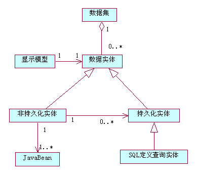
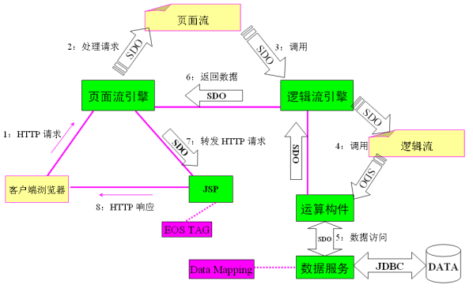
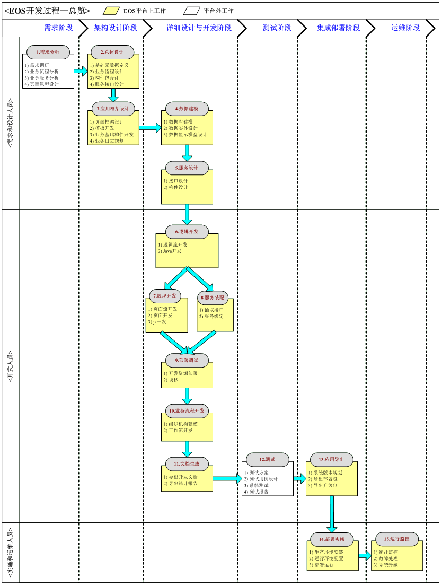

eos学习笔记

# EOS原理

## 应用层次架构

### 资源层:访问数据资源

ESB:ESB全称为Enterprise Service Bus，即[企业服务总线](https://baike.sogou.com/lemma/ShowInnerLink.htm?lemmaId=76026835)。它是传统[中间件技术](https://baike.sogou.com/lemma/ShowInnerLink.htm?lemmaId=43055696)与XML、[Web服务](https://baike.sogou.com/lemma/ShowInnerLink.htm?lemmaId=26296)等技术结合的产物。

DB: data base

CRM: CRM管理系统又称为CRM客户管理系统或客户关系管理系统，是一种通俗化语言，CRM是Customer Relationship Management的缩写。

下图是数据定义的核心概念模型：

* 持久化实体
   持久化实体是可以保存到持久化介质中的数据实体，它除了用一个xml schema描述数据结构的名称、类型等内容外，还包括一个mapping文件，描述数据结构和持久化实体之间的对应关系。
* 非持久化实体
   非持久化实体类似DTO对象，是不需要持久化的。
* SQL定义查询实体: 查询实体也是一种持久化实体，类似数据库视图，只能用于查询。

### 构件层

三种构件实现业务操作:

* Java构件: 需要符合SCA_JavaAnnotationsAndAPIs_V100的规范，

* Spring构件: 内置对Spring编程的支持, 就是Spring Bean

* 逻辑构件: 图形化编程;

### 服务层

将构件层编写的构件装配成服务的方式，暴露给其他模块或者其他系统。在技术上可以体现为==WebService，也可以体现为Java Interface、EJB、JMS等==多种调用方式. 服务层的核心思想是将构件实现装配为对外的服务，将小构件装配为大构件，将大构件装配为更大粒度的具有业务语义的构件

* WebService: Web service是一个平台独立的，低耦合的，自包含的、基于可编程的web的应用程序，可使用开放的XML（标准[通用标记语言](https://baike.sogou.com/lemma/ShowInnerLink.htm?lemmaId=68713543&ss_c=ssc.citiao.link)下的一个子集）标准来描述、发布、发现、协调和配置这些应用程序，用于开发分布式的[互操作](https://baike.sogou.com/lemma/ShowInnerLink.htm?lemmaId=363004&ss_c=ssc.citiao.link)的应用程序

* Java Interface

* EJB: 企业级JavaBean（Enterprise JavaBean EJB）是一个用来构筑企业级应用的服务器端可被管理组件。

* JMS: JMS即Java消息服务（Java Message Service）[应用程序接口](https://baike.sogou.com/lemma/ShowInnerLink.htm?lemmaId=350170&ss_c=ssc.citiao.link)是一个[Java平台](https://baike.sogou.com/lemma/ShowInnerLink.htm?lemmaId=628795&ss_c=ssc.citiao.link)中关于面向[消息中间件](https://baike.sogou.com/lemma/ShowInnerLink.htm?lemmaId=44506865&ss_c=ssc.citiao.link)（MOM）的API，用于在两个应用程序之间，或[分布式系统](https://baike.sogou.com/lemma/ShowInnerLink.htm?lemmaId=5697460&ss_c=ssc.citiao.link)中发送消息，进行[异步通信](https://baike.sogou.com/lemma/ShowInnerLink.htm?lemmaId=28922&ss_c=ssc.citiao.link)。Java消息服务是一个与具体平台无关的API，绝大多数MOM提供商都对JMS提供支持。 

### 流程层

流程层提供了BPS，帮助客户实现人与人之间的工作协调，人工任务与自动任务间的协调。

BPS是针对工作中具有固定程序的常规活动而提出的一个概念，通过将工作活动分解来定义良好的任务、角色、规则和过程，进而进行执行和监控，达到提高生产组织水平和工作效率的目的。

### 协同层

支持HTTP接入、EJB接入、Web-Service接入、Ajax等多种方式接入EOS系统。

提供了客户端接入接口，允许GUI程序，或者第三方应用通过客户端接口访问EOS应用提供的服务。EOS客户端接入支持EJB和WebService两种调用模式。

在接入层最核心的功能是提供了页面流功能，EOS页面流引擎负责页面的跳转、页面间的状态流转、调用服务层提供的服务，或者直接调用构件层构件的接口。

SSO: 英文全称Single Sign On，[单点登录](https://baike.sogou.com/lemma/ShowInnerLink.htm?lemmaId=8068024&ss_c=ssc.citiao.link)。SSO是在多个应用系统中，用户只需要登录一次就可以访问所有相互信任的应用系统。它包括可以将这次主要的登录映射到其他应用中用于同一个用户的登录的机制。它是目前比较流行的企业业务整合的解决方案之一。

## 服务构件架构

服务构件架构SCA（Service Component Architecture）是标准, 通过SCA可以大大简化用户构造面向服务架构SOAs（Service-Oriented Architectures）应用的过程。

使用SCA装配模型，我们可以方便的将构件的服务，暴露为不同的调用协议，比如将服务暴露为Web Service、JMS、RMI、EJB等，服务构件的应用也可以使用不同的协议，比如Web Service、JMS、RMI、EJB等调用其他构件提供的服务

## 服务数据对象

SDO（Service Data Object）旨在创建一个统一的数据访问层，以一种可以服从工具和框架的易用方式为不同的数据源提供一种数据访问解决方案。

## 数据处理过程

### 接入引擎:

可以用Http、Web Service、EJB等方式访问基于EOS开发的服务或者逻辑。EOS的核心模式还是采用"浏览器+服务器"模式。

传统的浏览器，服务器模式下，浏览器采用Http的GET/POST方式向服务器提交键/值对，而在Ajax模式下，浏览器会向服务器提交XML数据或者JSON（JavaScript Object Notation）等类型的数据。

- 提供拦截过滤器的功能。此功能类似于J2EE的Servelt Filter的功能，使用此功能，开发人员可以不修改J2EE的配置文件，注册请求拦截器；
- 将从浏览器传入的各种类型的数据，比如键值对、XML、JSON对象，转换成SDO或者JavaBean对象；
- 将从浏览器传来的请求分发给不同的处理引擎，比如页面流引擎。

### 数据上下文:

### 数据流转过程

### 页面流数据处理

页面流使用到的数据上下文分为三个数据区，包括会话上下文数据区、页面流上下文数据区、请求上下文数据区。会话上下文数据区存储的数据是当前用户所在的Http会话数据的一个映射。
开发人员开发页面流的时候可以使用s:XPATH_EXPRESSION来访问会话数据区中的数据，访问会话数据区中表达式的前缀为s:，XPATH_EXPRESSION的编写规范，参见《EOS基础参考手册》中的"Xpath"部分。访问页面流上下文数据区的表达式为f:XPATH_EXPRESSION。
页面流上下文数据区的数据生命周期相当于页面流流程级别的变量，在一个页面流实例中的不同的页面、业务逻辑、赋值操作都可以使用页面流上下文中的数据。请求上下文数据区中放置的是一个完整的Http Request/Response过程中产生的数据。
当EOS的页面引擎接受到一个Http Request的请求后，它会将这个请求的Key/Value参数按照规则，转换成一个或者多个Java对象放入到请求上下文数据区中；也可以使用复制图元访问或创建请求上下文数据区中的数据；调用业务逻辑或者服务的返回值也可以设置到请求上下文的数据区中。
访问请求上下文数据区中的数据可以采用r:XPATH_EXPRESSION或者不带前缀，直接使用XPATH_EXPRESSION访问请求上下文数据区中的数据。

### 逻辑流数据处理

* 受控用户对象上下文简称为MUO（Managed User Object）上下文；
* 逻辑流上下文数据区和页面流的请求上下文数据区类似。 

访问逻辑流请求上下文的数据直接采用XPATH_EXPRESSION访问，不需要加任何前缀。

MUO上下文数据区数据的配置请参见《EOS管理员手册》中的"Governor配置功能\MUO配置\MUO属性信息配置"。

访问MUO上下文数据区中的数据采用m:XPATH_EXPRESSION的方式

### 工作流数据处理

只包含流程上下文。数据上下文的其他数据区多数都是只保存到内存中的, 少数特殊情况会保存到数据库中。

# 开发过程

## TODO:架构设计, 详细设计开发;

## 集成部署:

应用导出有两种方式，一种是全量EAR应用的导出，一种是增量部署包的导出。

前者适合倾向于使用标准的EAR部署方式，部署EAR应用的客户；后者适合于使用EOS提供的安装包安装EAR应用后，再通过EOS Governor进行增量部署的客户。

全量EAR应用导出:生成结果是一个EAR压缩文件（对于Tomcat是一个WAR文件）

用户通过应用服务器的EAR/WAR部署方式，将应用部署到应用服务器上，如通过WebLogic、WebSphere控制台部署EAR应用，或将EAR或WAR包文件，或解压后的目录，直接放在Tomcat的webapps目录下等部署方式。

用于第一次上线部署

上线后的应用升级，可以使用全量EAR应用导出+EAR应用部署来实施应用的上线。

集群的EAR的更新，也可以采用通过控制台重新更新EAR应用的方式来部署和升级应用

导出EAR时的一般规则

先选择要导出的项目，支持选择多个项目

选择部署应用的服务器的类型和版本号，这样可以导出和特定应用服务器类型和版本号匹配的EAR文件

重新编译选项可以默认不勾选，不勾选会导出Studio工作空间内已经编译好的程序；

导出多个项目时，需要选择一个包含应用配置文件的项目，导出的EAR中的EOS应用配置以这个项目的配置为准，其他项目中的应用配置文件被忽略。我们建议选一个基准的项目放置应用的配置文件。

需要导出应用系统引用的外部jar包，同样先需要在项目的Java构建路径的库中添加所需要的jar包，导出EAR时一起导出。

导出EAR：EOS Studio中资源树右键菜单 -> 导出 -> EOS -> 导出EAR。

增量部署包

* 构件包部署包（ecd）

* 构件包补丁包（epd）

前者是以构件包为单位的全量部署包，可以包含多个构件包，一般以一个项目为单位导出一个部署包；

后者是以构件包为单位的增量文件的压缩包，可以包含多个构件包的增量文件，主要用于打补丁或系统升级。

通过应用服务器的控制台（如WebLogic、WebSphere），部署EAR应用；对于Tomcat或JBoss，可以直接将WAR文件或EAR文件，或解压目录放入部署目录下（如Tomcat的webapps目录或JBoss的server\default\deploy目录）。

通过EOS Governor管理应用，向已经安装过的EOS应用上增量部署程序，

# 术语相关

1. eos:Enterprise-on-Service, 
2. SOA（Service Oriented Architecture）面向服务的架构。
   1. eos是soa应用平台?
3. bps: 'Business-on-Process'
   1. bps是soa业务流程平台?
4. 

# 问题

需要弄明白的问题:

1. 页面流是用于描述用户界面元素流转关系的图形化流程，它是由开始节点、结束节点、逻辑流节点、服务节点（可选节点）、返回页面节点和连线等组成的。
2. 数据模型EOS提供了数据建模工具，支持数据实体和数据库表的映射，支持从数据库表生成持久化数据实体，从持久化数据实体生成数据模型。
3. Spring Bean:EOS提供了Spring框架的开发期支持和运行期支持，开发期通过Studio可以直接创建Spring Bean，并自动生成Spring配置文件，运行期Server内置Spring容器，可以实现Spring Bean的IOC（依赖注入）功能。
4. 构件包是EOS系统发布和复用的基本单位，它由逻辑流、页面流、服务构件、Java代码（包括运算逻辑和Spring Bean）、页面资源等组成。一个构件包通常能够完成一个相对独立、完整的业务功能。
   1. EOS构件包相当于一组资源的容器或命名空间；
   2. 同一个EOS构件包中的EOS构件不能重名；
   3. EOS平台对构件的调用是通过包名来定位EOS构件所在的包。
5. 业务流程: 业务流程是用于完成包含人工和自动的业务活动流程的构件，它是通过BPS for EOS开发环境来开发的流程管理的图形化描述。