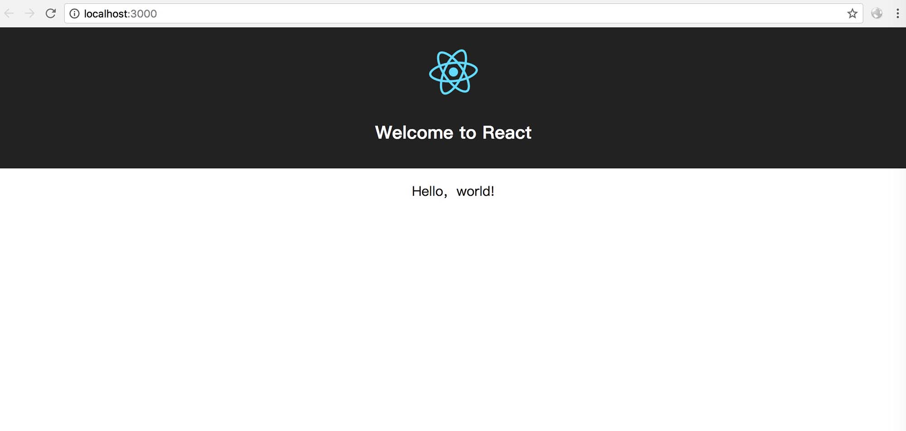

# 基础环境

1．Node.js

开发React应用前，需要先安装Node.js

2．NPM

NPM是一个模块管理工具，用来管理模块的发布、下载及模块之间的依赖关系。

NPM已集成到Node.js的安装包中。

[Yarn](https://yarnpkg.com)，可以作为NPM的替代工具。

3. Webpack

Webpack本身是一个模块，可通过NPM安装。

Webpack是js的模块打包工具。Webpack会所有模块打包到少量文件中，配合相关插件的使用，它还可以打包图片资源和样式文件。

4．Babel

Babel是一个JavaScript编译器，它可以将ES 6及其以后的语法编译成ES 5的语法，从而让我们可以在开发过程中尽情使用最新的JavaScript语法，一般会和Webpack一起使用，在Webpack编译打包的阶段将ES 6及其以后的语法编译成ES 5语法。

5．ESLint

ESLint是一个插件化的Js代码检测工具，可检查语法错误，又可以进行代码风格检查，从而保证团队内不同开发人员编写的代码都能遵循统一的代码规范。

使用ESlint必须要指定一套代码规范的配置。目前，业内比较好的规范是Airbnb的规范，但这套规范过于严格，可以先继承这套规范，然后在它的基础上根据实际需求对规范进行修改。

6.　Create React App

React 官方提供的脚手架工程Create React App基于最佳实践，将Webpack、Babel、ESlint 等工具的配置做了封装，使用Create React App创建的项目无须进行任何配置工作，从而使开发者可以专注于应用开发

1．安装 

打开命令行终端，依次输入以下命令：

```
     npm install -g create-react-app 
```

通过使用 –g 参数，我们将create-react-app
安装到了系统的全局环境，这样就可以在任意路径下使用它了。

2．创建应用 {.kindle-cn-heading2}

使用create-react-app创建一个新应用，在命令行终端执行：

```bash
     npx create-react-app my-app
```

这时会在当前路径下新建一个名为my-app的文件夹，my-app也就是我们新创建的React应用。

3．运行应用 {.kindle-cn-heading2}

在命令行终端执行：

```
     cd my-app 
     npm start
```

当应用启动成功后，在浏览器地址栏输入http://localhost:3000
即可访问应用，界面如图1-1所示。

{.kindle-cn-bodycontent-image-alone80-withnote}


index.js导入了模块App.js，修改App.js，将它的render方法修改如下：

```
     render() {
       return (
         <div className="App">
           <div className="App-header">
             
             <h1>Welcome to React</h1>
           </div>
           <p className="App-intro">
             Hello，world!
           </p>
         </div>
        );
      }
```

保存文件后，可以发现浏览器页面实时进行了更新，这是因为Create React
App也包含热加载功能，可实时更新代码变化。新的页面白色背景区域显示“Hello，world!”，如图1-3所示。

<div class="kindle-cn-bodycontent-div-alone100">

{.kindle-cn-bodycontent-image-alone80-withnote}
图1-3

至此，我们完成了第一个React应用。