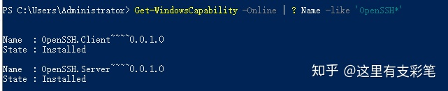
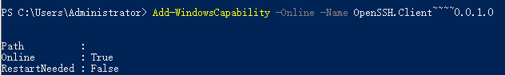
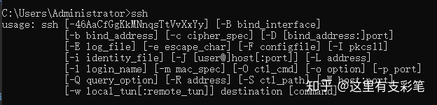
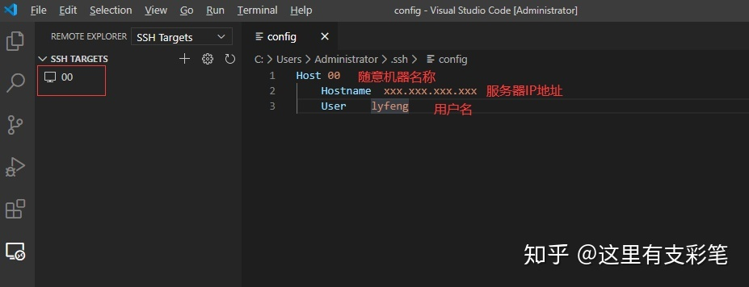
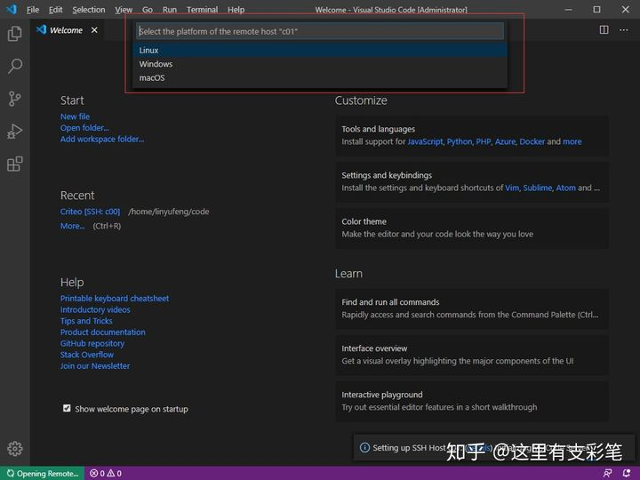
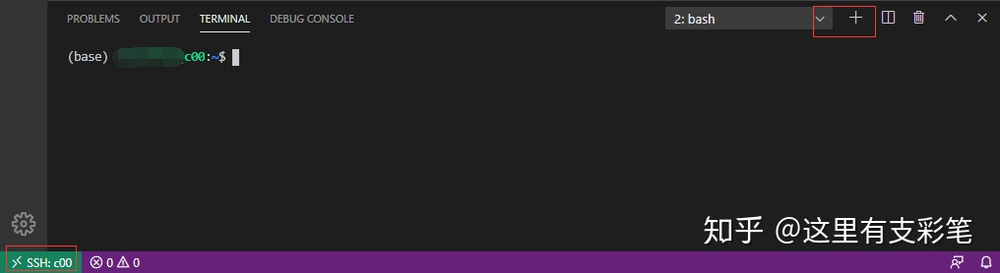
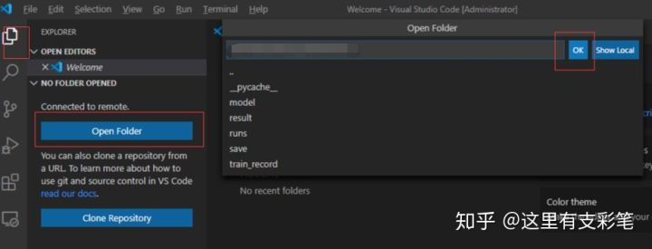

# 查看log
## 查看当前服务器运行了哪些容器并查看log:
```bash
sudo docker ps
sudo docker logs --tail 10 -f 3691c57239fd
```

## 使用VScode连接远程服务器进行开发
### 安装OpenSSH
该服务的作用是让你可以在终端使用ssh指令，Windows10通常自带OpenSSH不需要安装。

Windows10下检查是否已经安装OpenSSH的方法：
按下快捷键Win + X，选择Windows PoweShell（管理员），输入以下指令：
Get-WindowsCapability -Online | ? Name -like 'OpenSSH*'
如果电脑未安装OpenSSH，则State会显示NotPresent：

如果未安装，则输入指令：
Add-WindowsCapability -Online -Name OpenSSH.Client~~~~0.0.1.0
安装完成后会出现以下输出：

OpenSSH安装成功后，Win+R输入cmd进入终端，输入ssh命令应该得到如下结果：

### 安装Remote-SSH
Remote-SSH是VScode的插件，安装完VScode以后，直接在插件中搜索ssh，即可找到Remote-SSH，点击install安装。


### 配置Remote-SSH  

安装完Remote-SSH以后左侧会出现一个远程资源管理的图标，选择SSH Targets，进入config配置文件

在配置文件中设置服务器信息，输入HostName和User，保存以后左侧会出现对应机器名称。

更改设置，File->Preferences->Settings->Extension->Remote-SSH，找到Show Login Terminal并勾选。

### 连接服务器
点击SSH TARGETS下的服务器旁边的按钮纽行连接，弹出让你输入密码

在这里可能会弹出让你选择服务器的平台，需要选择以后才会出现输入密码的步骤


成功连上服务器，点击有右侧的+号创建服务器的终端窗口，可以正常使用了！


我们还可以打开服务器的文件夹


打开以后可以看到服务器文件目录，直接在文件目录中选择文件进行编辑，实时同步到服务器上，这时候已经可以开始愉快的进行开发了，开发体验媲美本地开发！


通过跳板机连接服务器
有时候我们需要跳板机来连接服务器，也即先连接一台跳板机服务器，然后通过这台跳板机所在的内网再次跳转到目标服务器。最简单的做法就是按上述方法连接到跳板机，然后在跳板机的终端用ssh指令跳转到目标服务器，但这样跳转后，我们无法在VScode中打开服务器的文件目录，操作起来很不方便。我们可以把config的设置改成如下，就可以通过c00跳板机跳转到c01了：
```
Host c00
    HostName xxx.xxx.xxx.xxx（跳板机IP）
    User lyfeng

Host c01
    HostName 192.168.0.10（内网地址）
    User lyfeng
    ProxyCommand "openssh的安装路径"\ssh.exe -W %h:%p -q c00
    # 连接c00, 再通过c00的局域网ssh到c01
```
openssh的安装路径因人而异（我这里是C:\Windows\System32\OpenSSH\ssh.exe）